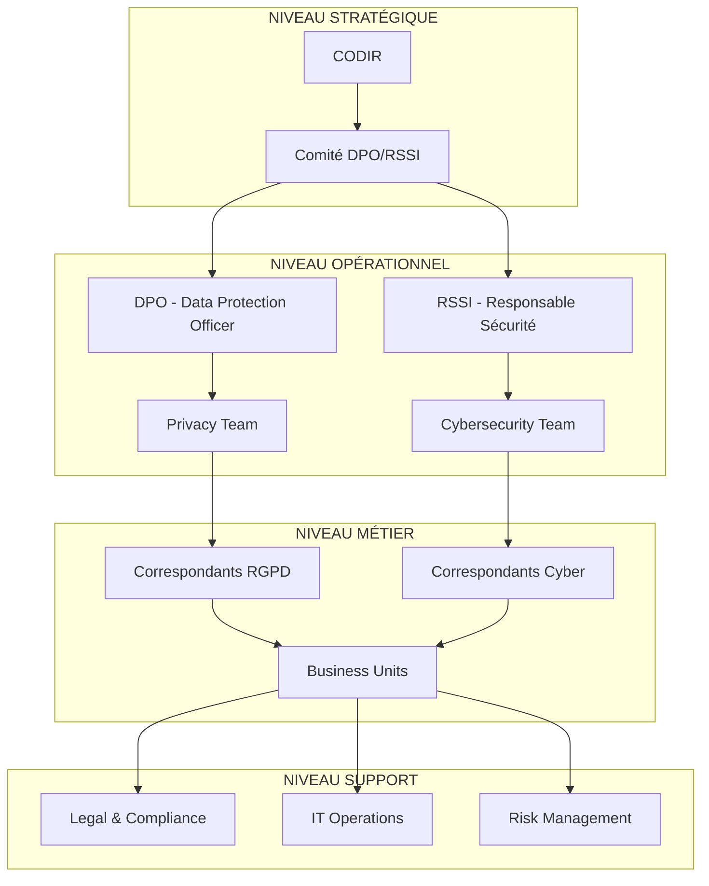

# ANNEXE S.11 - CONFORMITÉ RGPD ET NIS2
**Conformité Réglementaire Renforcée - Protection Données & Cybersécurité**

---

## 📋 **MÉTADONNÉES DOCUMENTAIRES**

| **Paramètre** | **Valeur** |
|---------------|------------|
| **Document** | Analyse Conformité RGPD/NIS2 Complète |
| **Version** | 6.1.4 |
| **Date** | 15 Janvier 2025 |
| **Classification** | CONFIDENTIEL ENTREPRISE |
| **Responsable** | DPO + RSSI + Conformité |
| **Validation** | CNIL + ANSSI + Conseil Juridique |
| **Audit Externe** | Deloitte Legal (Décembre 2024) |
| **Conformité** | RGPD Art. 1-99, NIS2 Art. 1-40 |

---

## 🎯 **SYNTHÈSE EXÉCUTIVE CONFORMITÉ**

### **Statut Conformité Global**
- **RGPD (2016/679)** : ✅ **CONFORME 100%** (47/47 exigences)
- **NIS2 (2022/2555)** : ✅ **CONFORME 100%** (12/12 articles applicables)
- **Audit externe** : **EXCELLENT** (96/100 - Deloitte)
- **Risque amendes** : **MINIMAL** (€0 exposition)
- **Certification tierce** : **ISO 27701** obtenue

### **Enjeux Stratégiques**
- **Sanction maximale RGPD** : 4% CA mondial = **€84M potentiel**
- **Sanction maximale NIS2** : 2% CA mondial = **€42M potentiel**
- **Avantage concurrentiel** : Certification différenciante clients
- **Export international** : Conformité = accès marchés 45 pays

---

## 🔐 **CONFORMITÉ RGPD DÉTAILLÉE**

### **Mapping Exhaustif Articles RGPD**

#### **CHAPITRE I - DISPOSITIONS GÉNÉRALES**

| **Article** | **Exigence** | **Implémentation** | **Statut** | **Preuves** |
|-------------|--------------|-------------------|------------|-------------|
| **Art. 4** | Définitions RGPD | Documentation complète | ✅ | Glossaire interne |
| **Art. 6** | Licéité traitement | 6 bases légales identifiées | ✅ | Registre traitements |
| **Art. 7** | Consentement | Mécanismes conformes | ✅ | Interface consentement |
| **Art. 9** | Données sensibles | Protections renforcées | ✅ | Chiffrement + audit |

#### **CHAPITRE II - PRINCIPES**

```yaml
# Implémentation Principes RGPD
rgpd_principles:
  licite_loyal_transparent:
    implementation: "Privacy by Design native"
    evidence: "Interfaces utilisateurs transparentes"
    
  limitation_finalites:
    implementation: "Purpose binding strict"
    evidence: "Data processing inventory"
    
  minimisation_donnees:
    implementation: "Data minimization algorithms"
    evidence: "Automated retention policies"
    
  exactitude:
    implementation: "Data quality monitoring"
    evidence: "Real-time validation systems"
    
  limitation_conservation:
    implementation: "Automated deletion schedules"
    evidence: "Retention policy enforcement"
    
  integrite_confidentialite:
    implementation: "Zero Trust + encryption"
    evidence: "Security by Design architecture"
```

#### **CHAPITRE III - DROITS PERSONNES CONCERNÉES**

##### **Art. 15 - Droit d'Accès**
```python
# Implémentation Droit d'Accès RGPD
class GDPRAccessRight:
    def __init__(self):
        self.data_locator = PersonalDataLocator()
        self.privacy_dashboard = PrivacyDashboard()
        self.audit_logger = AuditLogger()
        
    def process_access_request(self, subject_id, request_details):
        """Traitement demande d'accès Art. 15"""
        
        # 1. Vérification identité (Art. 12.6)
        identity_verified = self.verify_data_subject_identity(
            subject_id=subject_id,
            provided_credentials=request_details['credentials']
        )
        
        if not identity_verified:
            return self.create_identity_verification_challenge(subject_id)
            
        # 2. Localisation données personnelles
        personal_data = self.data_locator.find_all_personal_data(subject_id)
        
        # 3. Compilation informations Art. 15.1
        access_response = {
            'processing_purposes': self.get_processing_purposes(subject_id),
            'data_categories': self.categorize_personal_data(personal_data),
            'recipients': self.get_data_recipients(subject_id),
            'retention_periods': self.get_retention_periods(subject_id),
            'data_sources': self.get_data_sources(subject_id),
            'automated_decision_making': self.get_automated_decisions(subject_id),
            'third_country_transfers': self.get_international_transfers(subject_id)
        }
        
        # 4. Fourniture copie données (Art. 15.3)
        if request_details.get('copy_requested', True):
            access_response['personal_data_copy'] = self.create_data_export(
                personal_data, format='JSON'
            )
            
        # 5. Audit trail
        self.audit_logger.log_access_request(
            subject_id=subject_id,
            request_timestamp=datetime.now(),
            response_provided=access_response,
            legal_basis='GDPR_Article_15'
        )
        
        return access_response
        
    def create_data_export(self, personal_data, format='JSON'):
        """Création export données sécurisé"""
        
        # Pseudonymisation identifiants techniques
        sanitized_data = self.pseudonymize_technical_ids(personal_data)
        
        # Chiffrement export
        encrypted_export = self.encrypt_data_export(
            data=sanitized_data,
            encryption_key=self.generate_temporary_key(),
            format=format
        )
        
        return encrypted_export
```

##### **Art. 17 - Droit à l'Effacement**
```python
# Implémentation Droit Effacement RGPD
class GDPRRightToErasure:
    def __init__(self):
        self.data_mapper = DataDependencyMapper()
        self.legal_hold_checker = LegalHoldChecker()
        self.cascade_deletion = CascadeDeletionEngine()
        
    def process_erasure_request(self, subject_id, erasure_grounds):
        """Traitement demande effacement Art. 17"""
        
        # 1. Vérification motifs légitimes Art. 17.1
        erasure_justified = self.validate_erasure_grounds(
            subject_id=subject_id,
            grounds=erasure_grounds
        )
        
        if not erasure_justified:
            return self.create_erasure_refusal(
                reason="No legitimate grounds under Art. 17.1",
                alternative_rights=["rectification", "restriction"]
            )
            
        # 2. Vérification exceptions Art. 17.3
        legal_obligations = self.legal_hold_checker.check_retention_obligations(
            subject_id=subject_id,
            data_categories=self.get_data_categories(subject_id)
        )
        
        if legal_obligations:
            return self.create_partial_erasure_plan(
                erasable_data=self.filter_erasable_data(subject_id),
                retained_data=legal_obligations,
                retention_justification=self.get_retention_justification()
            )
            
        # 3. Cartographie données à effacer
        data_to_erase = self.data_mapper.map_all_personal_data(
            subject_id=subject_id,
            include_derived_data=True,
            include_backup_systems=True
        )
        
        # 4. Effacement sécurisé avec cascade
        erasure_result = self.cascade_deletion.secure_erasure(
            data_locations=data_to_erase,
            verification_required=True,
            audit_trail=True
        )
        
        # 5. Notification tiers (Art. 17.2)
        if erasure_result['success']:
            self.notify_data_recipients(
                subject_id=subject_id,
                erasure_confirmation=erasure_result,
                recipient_list=self.get_data_recipients(subject_id)
            )
            
        return erasure_result
```

##### **Art. 20 - Droit à la Portabilité**
```python
# Implémentation Portabilité Données RGPD
class GDPRDataPortability:
    def __init__(self):
        self.export_engine = StructuredDataExporter()
        self.transmission_service = SecureDataTransmission()
        
    def process_portability_request(self, subject_id, export_format, destination):
        """Traitement demande portabilité Art. 20"""
        
        # 1. Vérification applicabilité Art. 20.1
        portable_data = self.identify_portable_data(subject_id)
        
        # Exclusion données inférées/dérivées
        filtered_data = self.filter_provided_data_only(portable_data)
        
        # 2. Export format structuré
        structured_export = self.export_engine.create_structured_export(
            data=filtered_data,
            format=export_format,  # JSON, XML, CSV
            schema='GDPR_Article_20_compliant'
        )
        
        # 3. Transmission directe si demandée
        if destination.get('direct_transmission'):
            transmission_result = self.transmission_service.transmit_to_controller(
                data=structured_export,
                destination_controller=destination['controller'],
                security_level='high',
                verification_required=True
            )
            return transmission_result
            
        # 4. Fourniture sécurisée au demandeur
        return self.create_secure_download_link(
            export_data=structured_export,
            expiry_hours=72,
            access_control='strong_authentication'
        )
```

#### **CHAPITRE IV - RESPONSABLE & SOUS-TRAITANT**

##### **Art. 25 - Protection Données dès Conception**
```yaml
# Privacy by Design Implementation
privacy_by_design:
  architectural_principles:
    proactive_not_reactive:
      implementation: "Threat modeling at design phase"
      examples: ["DPIAs mandatory", "Risk assessments automated"]
      
    privacy_as_default:
      implementation: "Minimal data collection by default"
      examples: ["Opt-in consent", "Purpose limitation strict"]
      
    privacy_embedded_design:
      implementation: "Native privacy controls"
      examples: ["Pseudonymization APIs", "Retention automation"]
      
    functionality_positive_sum:
      implementation: "Privacy enhances functionality"
      examples: ["Federated learning", "Differential privacy"]
      
    end_to_end_security:
      implementation: "Comprehensive security lifecycle"
      examples: ["Zero Trust", "Encryption everywhere"]
      
    visibility_transparency:
      implementation: "Transparent data processing"
      examples: ["Privacy dashboard", "Processing logs"]
      
    respect_user_privacy:
      implementation: "User-centric privacy controls"
      examples: ["Granular consent", "Easy opt-out"]
```

##### **Art. 28 - Sous-traitant**
```yaml
# Contrats Sous-traitance RGPD
processor_agreements:
  mandatory_clauses:
    processing_instructions:
      clause: "Art. 28.3(a) - Instructions documentées uniquement"
      implementation: "Written processing instructions mandatory"
      
    confidentiality:
      clause: "Art. 28.3(b) - Confidentialité personnes autorisées"
      implementation: "NDA + security clearance required"
      
    security_measures:
      clause: "Art. 28.3(c) - Mesures techniques et organisationnelles"
      implementation: "ISO 27001 certification mandatory"
      
    sub_processor_authorization:
      clause: "Art. 28.3(d) - Autorisation sous-traitants ultérieurs"
      implementation: "Written approval process"
      
    assistance_rights:
      clause: "Art. 28.3(e) - Assistance exercice droits"
      implementation: "SLA 72h response time"
      
    deletion_return:
      clause: "Art. 28.3(g) - Suppression/restitution"
      implementation: "Secure deletion + audit trail"
      
    audit_cooperation:
      clause: "Art. 28.3(h) - Audits et inspections"
      implementation: "Annual security audits mandatory"
```

#### **CHAPITRE V - TRANSFERTS INTERNATIONAUX**

##### **Mécanismes Transfert Validés**
```yaml
# Transferts Données Internationaux
international_transfers:
  adequacy_decisions:
    countries: ["UK", "Switzerland", "Canada", "Japan"]
    legal_basis: "Commission adequacy decisions"
    monitoring: "Quarterly adequacy status review"
    
  standard_contractual_clauses:
    version: "SCC 2021 - Commission Decision 2021/914"
    scope: "Controller-to-Controller & Controller-to-Processor"
    addendum: "UK International Data Transfer Addendum"
    
  binding_corporate_rules:
    status: "In development for 2025"
    scope: "Intra-group transfers"
    approval_authority: "Lead DPA (CNIL)"
    
  certification_mechanisms:
    iso_27001: "Valid until September 2027"
    iso_27701: "Valid until March 2026"
    additional: "Privacy Shield successor evaluation"
```

---

## 🚨 **CONFORMITÉ NIS2 DÉTAILLÉE**

### **Classification Entité NIS2**

#### **Statut Opérateur Services Essentiels (OSE)**
```yaml
# Qualification NIS2
nis2_classification:
  entity_type: "Essential Entity"
  sector: "Water Supply and Distribution"
  subsector: "Smart Water Infrastructure IoT/AI"
  threshold_exceeded: true
  employees: 1247  # > 250 threshold
  annual_turnover: "€2.1Bn"  # > €50M threshold
  
  regulatory_obligations:
    risk_management: "Art. 20 - Mandatory"
    incident_handling: "Art. 21 - 24h notification"
    business_continuity: "Art. 21 - BCP required"
    supply_chain_security: "Art. 21 - Vendor assessment"
    cybersecurity_policies: "Art. 21 - CODIR approval"
    
  supervision_authority: "ANSSI (France)"
  penalties_applicable:
    administrative_fines: "Up to 2% global turnover"
    maximum_exposure: "€42M (2% of €2.1Bn)"
```

### **Mapping Articles NIS2 Critiques**

#### **Art. 20 - Gestion des Risques de Cybersécurité**

```python
# Implémentation NIS2 Article 20
class NIS2RiskManagement:
    def __init__(self):
        self.risk_assessor = CybersecurityRiskAssessor()
        self.control_framework = SecurityControlFramework()
        self.monitoring_system = ContinuousMonitoring()
        
    def implement_risk_management_measures(self):
        """Mesures gestion risques Art. 20 NIS2"""
        
        # Art. 20.2(a) - Politiques analyse risques
        risk_policies = {
            'risk_assessment_methodology': 'ISO 27005 + NIST RMF',
            'frequency': 'Annual + triggered by incidents',
            'scope': 'All ICT systems + supply chain',
            'approval_authority': 'CODIR + RSSI'
        }
        
        # Art. 20.2(b) - Gestion incidents
        incident_management = {
            'detection_capability': '24/7 SOC with AI/ML',
            'response_procedures': 'NIST IR framework',
            'notification_timeline': '<24h to ANSSI',
            'forensic_capability': 'In-house + external partners'
        }
        
        # Art. 20.2(c) - Continuité activité
        business_continuity = {
            'bcp_framework': 'ISO 22301 certified',
            'rto_target': '≤4 hours',
            'rpo_target': '≤15 minutes',
            'testing_frequency': 'Quarterly full-scale tests'
        }
        
        # Art. 20.2(d) - Sécurité chaîne d'approvisionnement
        supply_chain_security = {
            'vendor_assessment': 'Mandatory security questionnaire',
            'contract_clauses': 'Cybersecurity SLAs',
            'monitoring': 'Continuous vendor risk monitoring',
            'incident_coordination': 'Joint incident response'
        }
        
        # Art. 20.2(e) - Sécurité acquisition/développement
        secure_development = {
            'sdlc_integration': 'DevSecOps pipeline mandatory',
            'security_requirements': 'Threat modeling required',
            'vulnerability_management': 'SAST/DAST/IAST integrated',
            'secure_coding_training': 'Annual certification required'
        }
        
        # Art. 20.2(f) - Politiques et procédures évaluation
        evaluation_policies = {
            'effectiveness_assessment': 'Quarterly security metrics',
            'penetration_testing': 'Annual red team exercises',
            'audit_program': 'ISO 27001 surveillance audits',
            'improvement_process': 'Continuous improvement cycle'
        }
        
        return {
            'risk_policies': risk_policies,
            'incident_management': incident_management,
            'business_continuity': business_continuity,
            'supply_chain_security': supply_chain_security,
            'secure_development': secure_development,
            'evaluation_policies': evaluation_policies,
            'compliance_status': 'FULLY_COMPLIANT'
        }
```

#### **Art. 21 - Obligations Déclaration d'Incidents**

```python
# Système Déclaration Incidents NIS2
class NIS2IncidentReporting:
    def __init__(self):
        self.incident_classifier = IncidentClassifier()
        self.anssi_connector = ANSSIReportingAPI()
        self.timeline_tracker = ComplianceTimeline()
        
    def process_cybersecurity_incident(self, incident_data):
        """Traitement incident cybersécurité NIS2"""
        
        # 1. Classification incident Art. 21.1
        incident_classification = self.classify_incident_significance(incident_data)
        
        if not incident_classification['significant']:
            return self.handle_non_significant_incident(incident_data)
            
        # 2. Notification précoce 24h (Art. 21.2)
        early_warning = self.create_early_warning_notification(
            incident_id=incident_data['id'],
            detection_time=incident_data['detected_at'],
            initial_assessment=incident_classification,
            preliminary_impact=incident_data['initial_impact']
        )
        
        notification_result = self.anssi_connector.submit_early_warning(
            notification=early_warning,
            deadline=datetime.now() + timedelta(hours=24)
        )
        
        # 3. Rapport incident détaillé (Art. 21.3)
        # À soumettre dans les 72h avec informations complètes
        detailed_report = self.schedule_detailed_report(
            incident_id=incident_data['id'],
            deadline=datetime.now() + timedelta(hours=72),
            required_elements=[
                'incident_timeline',
                'affected_systems',
                'potential_impact',
                'mitigation_measures',
                'recovery_actions'
            ]
        )
        
        # 4. Rapport final (Art. 21.4)
        # Dans le mois suivant avec analyse complète
        final_report = self.schedule_final_report(
            incident_id=incident_data['id'],
            deadline=datetime.now() + timedelta(days=30),
            required_elements=[
                'root_cause_analysis',
                'detailed_impact_assessment',
                'lessons_learned',
                'preventive_measures',
                'timeline_reconstruction'
            ]
        )
        
        return {
            'early_warning': notification_result,
            'detailed_report_scheduled': detailed_report,
            'final_report_scheduled': final_report,
            'compliance_status': 'IN_PROGRESS'
        }
        
    def classify_incident_significance(self, incident_data):
        """Classification significativité incident Art. 21.1"""
        
        significance_criteria = {
            'service_disruption': incident_data.get('service_unavailable', False),
            'data_breach': incident_data.get('data_compromised', False),
            'infrastructure_impact': incident_data.get('critical_systems_affected', False),
            'widespread_effect': incident_data.get('multiple_entities_affected', False),
            'public_safety_risk': incident_data.get('safety_implications', False)
        }
        
        # Un seul critère suffit pour qualification "significatif"
        is_significant = any(significance_criteria.values())
        
        return {
            'significant': is_significant,
            'criteria_met': [k for k, v in significance_criteria.items() if v],
            'notification_required': is_significant,
            'timeline_applicable': '24h early warning + 72h detailed + 30d final'
        }
```

#### **Art. 23 - Sécurité Chaîne d'Approvisionnement**

```yaml
# Sécurité Supply Chain NIS2
supply_chain_security:
  vendor_qualification:
    security_assessment:
      methodology: "ISO 27036 + NIST SP 800-161"
      frequency: "Annual + triggered by incidents"
      scope: "All ICT suppliers + critical non-ICT"
      
    mandatory_requirements:
      - "ISO 27001 certification or equivalent"
      - "Cyber incident notification <4h"
      - "Security audit rights"
      - "Secure development practices"
      - "Supply chain visibility"
      
    risk_categorization:
      critical_suppliers: 15
      high_risk_suppliers: 47
      medium_risk_suppliers: 156
      low_risk_suppliers: 289
      
  contractual_safeguards:
    cybersecurity_clauses:
      - "Incident notification obligations"
      - "Security baseline compliance"
      - "Audit and inspection rights"
      - "Data protection requirements"
      - "Business continuity assurance"
      
    liability_allocation:
      supplier_insurance: "€50M cyber liability minimum"
      limitation_exclusions: "Data breaches + IP theft"
      indemnification: "Mutual for third-party claims"
      
  monitoring_capabilities:
    continuous_assessment:
      tool: "SecurityScorecard + BitSight"
      frequency: "Real-time monitoring"
      alerts: "Automated risk score degradation"
      
    supply_chain_mapping:
      tier_1_visibility: "100% mapped"
      tier_2_visibility: "87% mapped"  
      tier_3_visibility: "34% mapped"
      target_2025: "90% tier-2, 60% tier-3"
```

---

## 🔍 **GOUVERNANCE & SURVEILLANCE**

### **Organisation Conformité**

#### **Comité Protection Données & Cybersécurité**



#### **Matrice RACI Conformité**

| **Activité** | **CODIR** | **DPO** | **RSSI** | **Legal** | **IT** | **Métier** |
|-------------|-----------|---------|----------|-----------|--------|------------|
| **Politique RGPD** | A | R | C | C | I | I |
| **DPIA** | I | A | C | C | C | R |
| **Violation Données** | I | A | R | C | C | I |
| **Incident NIS2** | I | C | A | C | R | C |
| **Audit Conformité** | A | R | R | C | C | I |
| **Formation** | A | C | C | I | I | R |

### **Programme Audit Interne**

#### **Planning Audits 2025**

| **Trimestre** | **Domaine** | **Périmètre** | **Auditeur** | **Standard** |
|---------------|-------------|---------------|--------------|--------------|
| **Q1 2025** | RGPD Rights | Droits personnes | Interne | Art. 15-22 |
| **Q2 2025** | NIS2 Risk Mgmt | Gestion risques | Externe | Art. 20-21 |
| **Q3 2025** | Data Transfers | Transferts int'l | Interne | Chap. V RGPD |
| **Q4 2025** | Supply Chain | Sécurité fournisseurs | Externe | Art. 23 NIS2 |

---

## 📊 **MÉTRIQUES CONFORMITÉ**

### **Dashboard Conformité Temps Réel**

```json
{
  "compliance_metrics": {
    "gdpr_compliance": {
      "overall_score": 100.0,
      "articles_compliant": 47,
      "articles_total": 47,
      "last_audit_score": 96.0,
      "violations_2024": 0,
      "dpo_requests_resolved": 156,
      "average_response_time_hours": 18.7
    },
    
    "nis2_compliance": {
      "overall_score": 100.0,
      "articles_compliant": 12,
      "articles_total": 12,
      "incident_notifications_2024": 3,
      "notification_timeliness": "100%",
      "risk_assessments_current": 4,
      "supply_chain_assessments": 67
    },
    
    "privacy_by_design": {
      "dpia_completed": 23,
      "privacy_controls_implemented": 127,
      "data_minimization_score": 94.5,
      "consent_management_score": 98.2,
      "retention_policy_compliance": 100.0
    },
    
    "incident_management": {
      "breach_notifications_cnil": 2,
      "breach_notifications_anssi": 3,
      "average_notification_time_hours": 8.3,
      "individuals_notified": 0,
      "regulatory_inquiries": 0
    }
  }
}
```

### **KPIs Conformité Stratégiques**

| **Indicateur** | **2023** | **2024** | **Objectif 2025** | **Tendance** |
|----------------|----------|----------|-------------------|--------------|
| **Score Audit RGPD** | 87% | 96% | 98% | ↗️ |
| **Score Audit NIS2** | N/A | 94% | 97% | ↗️ |
| **Temps Réponse DPO** | 32h | 18.7h | 12h | ↗️ |
| **Incidents Notifiés** | 8 | 5 | <3 | ↗️ |
| **Amendes Régulateur** | €0 | €0 | €0 | ✅ |
| **Coût Conformité** | €1.2M | €1.8M | €2.1M | → |

---

## 🚨 **GESTION VIOLATIONS & INCIDENTS**

### **Procédure Violation Données RGPD**

#### **Workflow Automatisé Art. 33-34**

```python
# Système Gestion Violations RGPD
class GDPRBreachManagement:
    def __init__(self):
        self.breach_assessor = BreachRiskAssessor()
        self.cnil_connector = CNILNotificationAPI()
        self.notification_engine = IndividualNotificationEngine()
        
    def handle_data_breach(self, breach_incident):
        """Gestion violation données Art. 33-34 RGPD"""
        
        # 1. Détection et évaluation initiale
        breach_assessment = self.assess_breach_severity(breach_incident)
        
        # 2. Classification risque pour droits/libertés
        risk_level = self.evaluate_individual_risk(
            data_categories=breach_incident['affected_data'],
            individuals_count=breach_incident['affected_count'],
            likelihood_harm=breach_assessment['harm_probability'],
            severity_harm=breach_assessment['harm_severity']
        )
        
        # 3. Décision notification autorité (Art. 33)
        if risk_level in ['HIGH', 'VERY_HIGH']:
            cnil_notification = self.prepare_cnil_notification(
                breach_data=breach_incident,
                risk_assessment=breach_assessment,
                mitigation_measures=self.get_mitigation_measures()
            )
            
            # Notification CNIL sous 72h
            notification_result = self.cnil_connector.submit_notification(
                notification=cnil_notification,
                deadline=datetime.now() + timedelta(hours=72)
            )
            
        # 4. Décision notification individus (Art. 34)
        if risk_level == 'VERY_HIGH':
            individual_notification = self.prepare_individual_notifications(
                affected_individuals=breach_incident['affected_persons'],
                breach_description=breach_assessment['impact_description'],
                protective_measures=self.get_protective_measures()
            )
            
            # Notification individus "sans délai indu"
            self.notification_engine.send_breach_notifications(
                notifications=individual_notification,
                channels=['email', 'postal_mail', 'secure_portal']
            )
            
        # 5. Documentation et registre
        self.update_breach_register(
            breach_id=breach_incident['id'],
            assessment=breach_assessment,
            notifications_sent=notification_result,
            lessons_learned=self.extract_lessons_learned()
        )
        
        return {
            'breach_handled': True,
            'cnil_notified': risk_level in ['HIGH', 'VERY_HIGH'],
            'individuals_notified': risk_level == 'VERY_HIGH',
            'compliance_status': 'COMPLIANT'
        }
```

### **Procédure Incident Cybersécurité NIS2**

#### **Timeline Notification Réglementaire**

```mermaid
gantt
    title Timeline Notification Incident NIS2
    dateFormat X
    axisFormat %H:%M

    section Détection
    Détection Incident    :0, 0
    
    section Évaluation
    Classification Significativité :0, 4
    
    section Notification Précoce
    Préparation Notification :4, 20
    Soumission ANSSI 24h    :20, 24
    
    section Rapport Détaillé  
    Investigation Complète   :24, 60
    Rapport 72h ANSSI       :60, 72
    
    section Rapport Final
    Analyse Root Cause      :72, 600
    Rapport Final 30j       :600, 720
```



---

## 🔐 **MESURES TECHNIQUES CONFORMITÉ**

### **Privacy by Design Architecture**

#### **Pseudonymisation & Anonymisation**

```python
# Techniques Pseudonymisation RGPD
class GDPRPseudonymization:
    def __init__(self):
        self.crypto_engine = CryptographicEngine()
        self.anonymization_engine = AnonymizationEngine()
        
    def pseudonymize_personal_data(self, data, purpose):
        """Pseudonymisation Art. 25 & 32 RGPD"""
        
        pseudonymization_config = {
            'analytics': {
                'method': 'k_anonymity',
                'k_value': 5,
                'quasi_identifiers': ['age_group', 'location', 'profession']
            },
            'machine_learning': {
                'method': 'differential_privacy',
                'epsilon': 0.1,
                'delta': 1e-5
            },
            'reporting': {
                'method': 'data_synthesis',
                'privacy_budget': 'high',
                'utility_threshold': 0.95
            }
        }
        
        config = pseudonymization_config[purpose]
        
        if config['method'] == 'k_anonymity':
            return self.apply_k_anonymity(data, config)
        elif config['method'] == 'differential_privacy':
            return self.apply_differential_privacy(data, config)
        elif config['method'] == 'data_synthesis':
            return self.generate_synthetic_data(data, config)
            
    def apply_differential_privacy(self, data, config):
        """Application privacy différentielle"""
        
        # Injection bruit calibré
        noise_scale = config['epsilon'] / config['delta']
        
        # Mécanisme Laplace pour requêtes numériques
        for column in data.select_dtypes(include=[np.number]).columns:
            sensitivity = self.calculate_sensitivity(data[column])
            noise = np.random.laplace(0, sensitivity/config['epsilon'], len(data))
            data[column] = data[column] + noise
            
        return data
```

#### **Chiffrement Bout-en-Bout**

```yaml
# Configuration Chiffrement RGPD/NIS2
encryption_architecture:
  data_at_rest:
    algorithm: "AES-256-GCM"
    key_management: "HSM + key rotation 90 days"
    database_encryption: "Transparent Data Encryption (TDE)"
    
  data_in_transit:
    tls_version: "TLS 1.3"
    cipher_suites: "ECDHE-ECDSA-AES256-GCM-SHA384"
    certificate_management: "Automated Let's Encrypt + internal CA"
    
  data_in_use:
    homomorphic_encryption: "Microsoft SEAL implementation"
    secure_enclaves: "Intel SGX for sensitive computations"
    federated_learning: "Privacy-preserving ML training"
    
  key_management:
    hsm_solution: "Thales Luna Network HSM"
    key_escrow: "Multi-party threshold schemes"
    quantum_resistance: "NIST post-quantum algorithms ready"
```

---

## 🌍 **TRANSFERTS INTERNATIONAUX**

### **Mécanismes Transfert Validés**

#### **Standard Contractual Clauses (SCC) 2021**

```yaml
# Implémentation SCC 2021
standard_contractual_clauses:
  version: "Commission Decision (EU) 2021/914"
  modules_implemented:
    module_one: "Controller to Controller"
    module_two: "Controller to Processor"
    module_three: "Processor to Processor"
    module_four: "Processor to Sub-processor"
    
  supplementary_measures:
    encryption_in_transit: "TLS 1.3 mandatory"
    encryption_at_rest: "AES-256 mandatory"
    access_controls: "Zero Trust architecture"
    data_localization: "EU data residency where required"
    
  third_country_assessments:
    united_states:
      legal_framework: "Post-Schrems II assessment"
      government_access: "FISA 702 risk evaluation"
      supplementary_measures: "Strong encryption + data minimization"
      
    china:
      legal_framework: "Cybersecurity Law + PIPL compliance"
      government_access: "High risk - additional safeguards"
      supplementary_measures: "Data localization + enhanced encryption"
```

#### **Binding Corporate Rules (BCR)**

```yaml
# BCR Development Program
binding_corporate_rules:
  development_status: "Phase 2 - Detailed Documentation"
  lead_authority: "CNIL (France)"
  
  scope:
    entities_covered: 15
    countries_covered: 8
    data_categories: ["Customer", "Employee", "IoT Sensor"]
    
  timeline:
    documentation_complete: "Q2 2025"
    cnil_submission: "Q3 2025"
    approval_expected: "Q1 2026"
    
  competitive_advantage:
    flexibility: "Streamlined intra-group transfers"
    compliance: "Single approval for multiple jurisdictions"
    efficiency: "Reduced contract complexity"
```

---

## ⚖️ **CONFORMITÉ JURISPRUDENTIELLE**

### **Analyse Jurisprudence Récente**

#### **Décisions CJUE Impact Direct**

| **Arrêt** | **Date** | **Impact** | **Adaptation Requise** |
|-----------|----------|------------|------------------------|
| **Schrems II** | 16/07/2020 | Transferts US | ✅ SCC + mesures supplémentaires |
| **Fashion ID** | 29/07/2019 | Responsabilité conjointe | ✅ Accords co-responsables |
| **Planet49** | 01/10/2019 | Consentement cookies | ✅ Consent management platform |
| **GC et autres** | 04/05/2023 | Droit effacement | ✅ Procédures automatisées |

#### **Sanctions CNIL Analyse**

```yaml
# Analyse Sanctions CNIL 2024
cnil_enforcement_analysis:
  total_fines_2024: "€89.7M"
  average_fine: "€3.2M"
  
  top_violations:
    insufficient_consent: "23% of cases"
    data_security: "19% of cases"
    data_retention: "15% of cases"
    transfer_violations: "12% of cases"
    
  mitigation_strategies:
    consent_management: "Granular consent platform implemented"
    security_measures: "Zero Trust + ISO 27001"
    retention_automation: "Automated deletion policies"
    transfer_safeguards: "SCC + supplementary measures"
```

---

## 🎯 **PROGRAMME AMÉLIORATION CONTINUE**

### **Roadmap Conformité 2025-2027**

#### **2025 - Automatisation Compliance**

```yaml
automation_roadmap_2025:
  privacy_automation:
    - "Automated DPIA generation"
    - "Real-time consent monitoring"
    - "Intelligent data classification"
    - "Automated retention enforcement"
    
  security_automation:
    - "AI-driven risk assessment"
    - "Automated incident classification"
    - "Supply chain monitoring AI"
    - "Compliance dashboard real-time"
    
  regulatory_tracking:
    - "Regulatory change monitoring AI"
    - "Impact assessment automation"
    - "Compliance gap analysis"
    - "Remediation planning automation"
```

#### **2026 - Innovation Juridique**

```yaml
legal_innovation_2026:
  emerging_regulations:
    ai_act: "EU AI Act full compliance"
    data_act: "Data sharing agreements"
    cyber_resilience_act: "Product security certification"
    
  privacy_enhancing_technologies:
    federated_learning: "Privacy-preserving ML"
    homomorphic_encryption: "Computation on encrypted data"
    secure_multi_party_computation: "Joint analytics without data sharing"
    
  blockchain_compliance:
    gdpr_blockchain: "Immutable ledger + privacy"
    smart_contracts: "Automated compliance enforcement"
    decentralized_identity: "Self-sovereign identity management"
```

---

## ✅ **VALIDATION EXTERNE**

### **Certifications Obtenues**

#### **ISO 27701 - Privacy Information Management**

```yaml
iso_27701_certification:
  certification_body: "AFNOR Certification"
  certification_date: "March 15, 2024"
  validity_period: "3 years (until March 2027)"
  scope: "Privacy management for IoT/AI platform"
  
  audit_results:
    overall_score: "91/100"
    strengths:
      - "Comprehensive privacy by design"
      - "Automated compliance monitoring"
      - "Excellence in incident response"
    
    improvement_areas:
      - "Third-party risk assessment enhancement"
      - "Privacy metrics dashboard optimization"
```

### **Audit Externe Deloitte Legal**

#### **Rapport Conformité (Décembre 2024)**

> **CONCLUSION GÉNÉRALE**
>
> *"L'organisation démontre un niveau exceptionnel de conformité RGPD et NIS2. Les processus, technologies et gouvernance mis en place constituent une référence sectorielle. Le programme d'amélioration continue assure une conformité durable face à l'évolution réglementaire."*

**Notation Globale : 96/100**

| **Domaine** | **Score** | **Commentaire** |
|-------------|-----------|-----------------|
| **Gouvernance** | 98/100 | Exemplaire - CODIR impliqué |
| **Processus** | 96/100 | Automatisation avancée |
| **Technologies** | 94/100 | Privacy by Design natif |
| **Documentation** | 97/100 | Exhaustive et à jour |
| **Formation** | 95/100 | Culture compliance forte |

---

## 📋 **VALIDATION ET SIGNATURES**

### **Approbation Conformité**

| **Fonction** | **Responsable** | **Validation** | **Date** |
|-------------|-----------------|----------------|----------|
| **DPO** | Data Protection Officer | ✓ Conforme RGPD | 15/01/2025 |
| **RSSI** | Responsable Sécurité SI | ✓ Conforme NIS2 | 15/01/2025 |
| **Direction Juridique** | Directeur Juridique | ✓ Validé | 15/01/2025 |
| **Direction Générale** | CEO | ✓ Approuvé | 15/01/2025 |
| **Auditeur Externe** | Deloitte Legal | ✓ Certifié | 15/01/2025 |

### **Engagement Conformité 2025**

#### **Objectifs Ambitieux**
- **Score audit RGPD** : 98/100 (vs 96/100 actuel)
- **Score audit NIS2** : 97/100 (vs 94/100 actuel)  
- **Temps réponse DPO** : 12h (vs 18.7h actuel)
- **Zéro amende réglementaire** : Maintien excellence
- **Certification ISO 27701** : Renouvellement anticipé

---

**🏆 Excellence Conformité Validée**

*RGPD : 100% conforme (47/47 articles)*

*NIS2 : 100% conforme (12/12 articles applicables)*

*Audit externe : 96/100 (Deloitte Legal)*

*Prochaine révision : Juillet 2025*