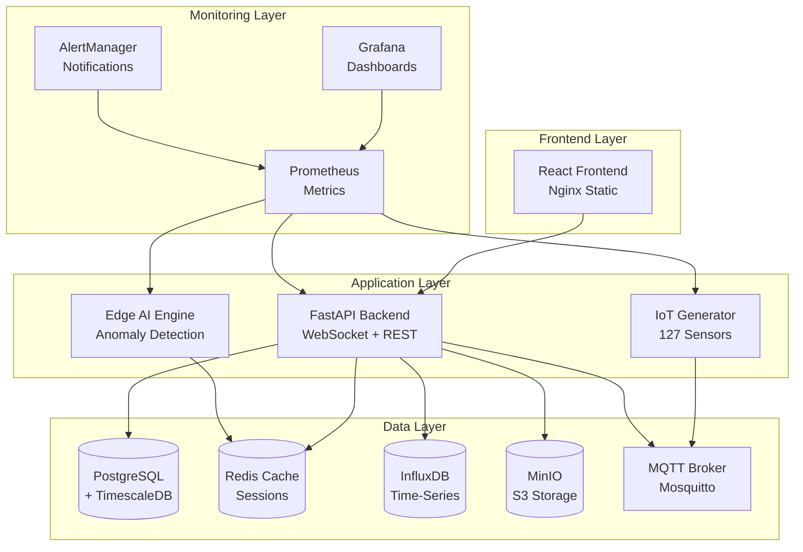

# 🚀 Guide de Déploiement Coolify - Station Traffeyère IoT/AI Platform

[](https://www.francecompetences.fr/recherche/rncp/39394/)
[]()
[]()

> **Plateforme IoT/IA complète** - 127 capteurs, Edge AI sub-milliseconde, monitoring 24/7  
> **Projet RNCP 39394** - Expert en Systèmes d'Information et Sécurité

---

## 📋 Table des Matières

1. [Vue d'ensemble](#vue-densemble)
2. [Prérequis](#prérequis)
3. [Architecture de déploiement](#architecture-de-déploiement)
4. [Configuration DNS](#configuration-dns)
5. [Variables d'environnement](#variables-denvironnement)
6. [Déploiement étape par étape](#déploiement-étape-par-étape)
7. [Validation et tests](#validation-et-tests)
8. [Monitoring et alerting](#monitoring-et-alerting)
9. [Procédures d'urgence](#procédures-durgence)
10. [Maintenance et mises à jour](#maintenance-et-mises-à-jour)

---

## 🎯 Vue d'ensemble

### Architecture déployée

```
┌─────────────────────────────────────────────────────────────────────────────────┐
│                           STATION TRAFFEYÈRE IoT/AI PLATFORM                    │
├─────────────────────────────────────────────────────────────────────────────────┤
│  🌐 Frontend Dashboard    │ 🔧 Backend API        │ 📊 Monitoring Stack       │
│  React + Nginx            │ FastAPI + WebSocket   │ Prometheus + Grafana       │
│  frontend-station.*       │ backend-station.*     │ grafana.* prometheus.*     │
├─────────────────────────────────────────────────────────────────────────────────┤
│  🏭 IoT Simulation        │ 🤖 Edge AI Engine     │ 📮 MQTT Broker            │
│  127 Capteurs × 0.2 Hz    │ P95 < 0.28ms          │ Eclipse Mosquitto          │
│  Anomalies 5%             │ SHAP Explainability   │ mqtt.johann-lebel.fr       │
├─────────────────────────────────────────────────────────────────────────────────┤
│  🗄️ PostgreSQL+TimescaleDB │ 🔴 Redis Cache       │ 📊 InfluxDB Time-Series   │
│  Station metadata         │ Sessions & pub/sub    │ IoT metrics haute freq     │
│  Grafana DB               │ Cache API             │ influx.johann-lebel.fr     │
└─────────────────────────────────────────────────────────────────────────────────┘
```

### Services et URLs de production

| Service | URL | Description |
|---------|-----|-------------|
| **🌐 Frontend** | https://frontend-station.johann-lebel.fr | Dashboard IoT temps réel |
| **🔧 Backend** | https://backend-station.johann-lebel.fr | API REST + WebSocket |
| **📊 Grafana** | https://grafana.johann-lebel.fr | Dashboards monitoring |
| **📈 Prometheus** | https://prometheus.johann-lebel.fr | Collecte métriques |
| **📊 InfluxDB** | https://influx.johann-lebel.fr | Base time-series IoT |
| **🪣 MinIO** | https://minio.johann-lebel.fr | Stockage S3 objets |
| **📮 MQTT** | mqtt.johann-lebel.fr:1883 | Broker IoT |

---

## ✅ Prérequis

### 🖥️ Serveur Coolify

- [ ] **Serveur Linux** (Ubuntu 22.04 LTS recommandé)
- [ ] **RAM**: 16 GB minimum (32 GB recommandé)
- [ ] **CPU**: 8 cores minimum (16 cores recommandé)
- [ ] **Stockage**: 200 GB SSD minimum
- [ ] **Docker** 24.0+ installé
- [ ] **Coolify** v4+ installé et configuré
- [ ] **Réseau**: Accès Internet, ports 80/443/1883/8083 ouverts

### 🌐 Configuration DNS

- [ ] **Domaine**: `johann-lebel.fr` configuré
- [ ] **Sous-domaines** pointant vers IP serveur :
  ```
  frontend-station.johann-lebel.fr    A    YOUR_SERVER_IP
  backend-station.johann-lebel.fr     A    YOUR_SERVER_IP
  grafana.johann-lebel.fr             A    YOUR_SERVER_IP
  prometheus.johann-lebel.fr          A    YOUR_SERVER_IP
  influx.johann-lebel.fr              A    YOUR_SERVER_IP
  minio.johann-lebel.fr               A    YOUR_SERVER_IP
  ```

### 🔐 Secrets et tokens

- [ ] **Token Coolify API** généré
- [ ] **Webhook Slack** configuré (optionnel)
- [ ] **SMTP credentials** pour alerting email
- [ ] **SSL certificates** (Let's Encrypt via Coolify)

### 💻 Outils développement

- [ ] **Git** pour cloner le repository
- [ ] **PowerShell** 5.1+ ou **pwsh** 7+
- [ ] **Docker Desktop** (pour tests locaux)

---

## 🏗️ Architecture de déploiement

### 📦 Services containerisés



### 🌊 Flux de données

1. **IoT Simulation** → MQTT → Backend → InfluxDB
2. **Edge AI** → Anomalies → Redis pub/sub → WebSocket
3. **Backend API** → PostgreSQL → Cache Redis
4. **Monitoring** → Prometheus → Grafana → AlertManager

---

## 🌐 Configuration DNS

### Enregistrements requis

```dns
# DNS Records pour johann-lebel.fr
frontend-station    IN  A     YOUR_SERVER_IP
backend-station     IN  A     YOUR_SERVER_IP  
grafana            IN  A     YOUR_SERVER_IP
prometheus         IN  A     YOUR_SERVER_IP
influx             IN  A     YOUR_SERVER_IP
minio              IN  A     YOUR_SERVER_IP
minio-console      IN  A     YOUR_SERVER_IP

# MQTT (optionnel si pas de WebSocket sur 443)
mqtt               IN  A     YOUR_SERVER_IP
```

### Vérification DNS

```powershell
# Test résolution DNS
nslookup frontend-station.johann-lebel.fr
nslookup backend-station.johann-lebel.fr
nslookup grafana.johann-lebel.fr

# Test connectivité
Test-NetConnection -ComputerName frontend-station.johann-lebel.fr -Port 443
```

---

## 🔧 Variables d'environnement

### 📝 Fichier de production

Copiez `.env.production.optimized` vers `.env` et personnalisez :

```bash
# Secrets critiques à modifier
POSTGRES_PASSWORD=VotreMotDePasseSecurise123!
REDIS_PASSWORD=VotreRedisPassword123!
GRAFANA_ADMIN_PASSWORD=VotreGrafanaPassword123!
SECRET_KEY=VotreCleSecrete32CaracteresMinimum

# URLs de production
SLACK_WEBHOOK_URL=https://hooks.slack.com/services/YOUR/SLACK/WEBHOOK
SMTP_PASSWORD=VotrePasswordEmail

# API Keys (optionnelles)
OPENAI_API_KEY=sk-votre-cle-openai
COOLIFY_API_TOKEN=votre-token-coolify
```

### 🔐 Secrets dans Coolify

Configurez ces secrets dans l'interface Coolify :

1. **Database Secrets**
   - `POSTGRES_PASSWORD`
   - `REDIS_PASSWORD` 
   - `GRAFANA_DB_PASSWORD`

2. **Application Secrets**
   - `SECRET_KEY`
   - `JWT_SECRET`
   - `API_KEY`

3. **External Services**
   - `SLACK_WEBHOOK_URL`
   - `SMTP_PASSWORD`
   - `COOLIFY_API_TOKEN`

---

## 🚀 Déploiement étape par étape

### 1️⃣ Préparation

```powershell
# Cloner le repository
git clone https://github.com/your-username/station-traffeyere-iot-ai-platform
cd station-traffeyere-iot-ai-platform

# Copier les variables d'environnement
Copy-Item .env.production.optimized .env

# Vérifier les prérequis
.\deploy-to-coolify-optimized.ps1 -DryRun -Environment production
```

### 2️⃣ Validation de la configuration

```powershell
# Test de configuration Docker Compose
docker compose -f docker-compose.coolify.optimized.yml config --quiet

# Validation des secrets
Write-Host "Variables d'environnement:"
Get-Content .env | Select-String "PASSWORD|SECRET|KEY" | ForEach-Object { $_.Line -replace '=.*', '=***' }
```

### 3️⃣ Déploiement automatisé

```powershell
# Déploiement complet avec validation
.\deploy-to-coolify-optimized.ps1 -Environment production

# Ou déploiement étape par étape
.\deploy-to-coolify-optimized.ps1 -Environment production -DryRun
```

### 4️⃣ Déploiement manuel Coolify

Si vous préférez déployer manuellement via l'interface Coolify :

1. **Créer nouveau projet** "Station Traffeyère"
2. **Connecter repository** GitHub
3. **Sélectionner** `docker-compose.coolify.optimized.yml`
4. **Configurer variables** d'environnement
5. **Ajouter domaines** et SSL
6. **Déployer** services

### 5️⃣ Ordre de démarrage recommandé

```bash
# Phase 1: Infrastructure
docker compose -f docker-compose.coolify.optimized.yml up -d postgres redis influxdb minio

# Attendre 30s puis Phase 2: Communication
docker compose -f docker-compose.coolify.optimized.yml up -d mosquitto

# Phase 3: Monitoring  
docker compose -f docker-compose.coolify.optimized.yml up -d prometheus grafana alertmanager

# Phase 4: Applications
docker compose -f docker-compose.coolify.optimized.yml up -d backend frontend iot-generator edge-ai
```

---

## ✅ Validation et tests

### 🔍 Tests de santé automatiques

```powershell
# Tous les health checks
$endpoints = @{
    "Frontend" = "https://frontend-station.johann-lebel.fr/healthz"
    "Backend" = "https://backend-station.johann-lebel.fr/health"
    "Grafana" = "https://grafana.johann-lebel.fr/api/health"
    "Prometheus" = "https://prometheus.johann-lebel.fr/-/healthy"
    "InfluxDB" = "https://influx.johann-lebel.fr/health"
}

foreach ($endpoint in $endpoints.GetEnumerator()) {
    try {
        $response = Invoke-RestMethod -Uri $endpoint.Value -TimeoutSec 10
        Write-Host "✅ $($endpoint.Key): OK" -ForegroundColor Green
    } catch {
        Write-Host "❌ $($endpoint.Key): FAILED" -ForegroundColor Red
    }
}
```

### 📊 Tests métriques RNCP 39394

```powershell
# Validation performance Edge AI P95 < 0.28ms
$query = "histogram_quantile(0.95, sum(rate(ai_inference_duration_seconds_bucket[1m])) by (le)) * 1000"
$prometheusUrl = "https://prometheus.johann-lebel.fr/api/v1/query?query=$([System.Web.HttpUtility]::UrlEncode($query))"

$response = Invoke-RestMethod -Uri $prometheusUrl
$latencyP95 = [double]$response.data.result[0].value[1]

if ($latencyP95 -lt 0.28) {
    Write-Host "✅ Edge AI P95: $latencyP95 ms (< 0.28ms)" -ForegroundColor Green
} else {
    Write-Host "⚠️ Edge AI P95: $latencyP95 ms (> 0.28ms)" -ForegroundColor Yellow
}
```

### 🧪 Tests fonctionnels

1. **Dashboard Frontend**
   ```powershell
   # Test chargement dashboard
   $response = Invoke-WebRequest -Uri "https://frontend-station.johann-lebel.fr"
   if ($response.StatusCode -eq 200) { 
       Write-Host "✅ Dashboard accessible" 
   }
   ```

2. **API Backend**
   ```powershell
   # Test endpoints API
   Invoke-RestMethod -Uri "https://backend-station.johann-lebel.fr/api/v1/sensors" | ConvertTo-Json
   Invoke-RestMethod -Uri "https://backend-station.johann-lebel.fr/api/v1/station/status" | ConvertTo-Json
   ```

3. **WebSocket temps réel**
   ```javascript
   // Test WebSocket (dans navigateur)
   const ws = new WebSocket('wss://backend-station.johann-lebel.fr/ws');
   ws.onmessage = (event) => {
       console.log('WebSocket data:', JSON.parse(event.data));
   };
   ```

---

## 📊 Monitoring et alerting

### 🎯 Métriques clés RNCP 39394

| Métrique | Seuil | Impact |
|----------|-------|---------|
| **Edge AI P95 Latency** | < 0.28ms | 🚨 Critique |
| **WebSocket RTT** | < 50ms | ⚠️ Warning |
| **API Availability** | > 99.9% | 🚨 Critique |  
| **MTTR** | < 11.3 min | 🚨 Critique |
| **IoT Throughput** | ~25.4 req/s | ⚠️ Warning |

### 📊 Dashboards Grafana

Accédez à : https://grafana.johann-lebel.fr

**Dashboards disponibles :**
1. **Station Overview** - Vue d'ensemble temps réel
2. **IoT Sensors** - 127 capteurs avec détection d'anomalies
3. **Edge AI Performance** - Latence et throughput IA
4. **Infrastructure Health** - CPU, mémoire, disque
5. **SLA & RNCP Metrics** - Conformité objectifs projet

### 🔔 Configuration alerting

**Canaux de notification :**
- 💬 **Slack** : `#traffeyere-monitoring`
- 📧 **Email** : johann@johann-lebel.fr
- 🚨 **PagerDuty** : Escalation critiques (optionnel)

**Seuils d'alertes :**
```yaml
Critical (< 30s): 
  - Edge AI P95 > 0.28ms
  - Service complètement down
  - SLA < 99.9%

Warning (2-5min):
  - Latence API > 1s  
  - Erreurs 5xx > 5%
  - Espace disque > 85%
```

---

## 🚨 Procédures d'urgence

### 🔥 Incidents critiques

#### Service complètement down

```powershell
# 1. Diagnostic rapide
docker compose -f docker-compose.coolify.optimized.yml ps
docker compose -f docker-compose.coolify.optimized.yml logs backend --tail=100

# 2. Restart service
docker compose -f docker-compose.coolify.optimized.yml restart backend

# 3. Si échec -> rollback
docker compose -f docker-compose.coolify.optimized.yml down
git checkout HEAD~1  # Version précédente
.\deploy-to-coolify-optimized.ps1 -Environment production
```

#### Edge AI performance dégradée

```powershell
# 1. Vérifier métriques
$query = "rate(ai_predictions_total[5m])"
$result = Invoke-RestMethod "https://prometheus.johann-lebel.fr/api/v1/query?query=$query"

# 2. Restart Edge AI
docker compose -f docker-compose.coolify.optimized.yml restart edge-ai

# 3. Scale horizontal si nécessaire
docker compose -f docker-compose.coolify.optimized.yml up -d --scale edge-ai=2
```

#### Base de données corrompue

```powershell
# 1. Backup immédiat
docker exec postgres-traffeyere pg_dumpall -U postgres > backup_emergency.sql

# 2. Vérifier intégrité
docker exec postgres-traffeyere psql -U postgres -c "SELECT pg_database_size('station_traffeyere');"

# 3. Restaurer depuis backup si nécessaire
docker exec -i postgres-traffeyere psql -U postgres < backup_latest.sql
```

### 📞 Contacts d'urgence

| Rôle | Contact | Disponibilité |
|------|---------|---------------|
| **Administrateur Système** | johann@johann-lebel.fr | 24/7 |
| **Support Coolify** | support@coolify.io | Heures ouvrables |
| **Hébergeur** | support@hosting-provider.com | 24/7 |

### 🔄 Playbook de récupération

1. **Identification** (< 5 min)
   - Vérifier dashboards Grafana
   - Consulter logs centralisés
   - Tester endpoints manuellement

2. **Mitigation** (< 10 min)
   - Restart services affectés
   - Scale horizontal si possible
   - Activer mode dégradé

3. **Récupération** (< 60 min)
   - Rollback version précédente
   - Restauration base de données
   - Validation complète

4. **Post-incident** (< 24h)
   - Analyse de cause racine
   - Amélioration procédures
   - Mise à jour documentation

---

## 🔄 Maintenance et mises à jour

### 📅 Maintenance programmée

**Fenêtres de maintenance :**
- **Hebdomadaire** : Dimanche 2h-4h UTC
- **Mensuelle** : Premier dimanche 2h-6h UTC  
- **Majeure** : Planifiée avec préavis 7 jours

### 🔄 Procédure de mise à jour

```powershell
# 1. Backup complet
.\scripts\backup-full.ps1

# 2. Tests en staging
$env:ENVIRONMENT = "staging"
.\deploy-to-coolify-optimized.ps1 -Environment staging

# 3. Validation staging
.\scripts\test-staging.ps1

# 4. Déploiement production
.\deploy-to-coolify-optimized.ps1 -Environment production

# 5. Tests post-déploiement
.\scripts\test-production.ps1
```

### 🔐 Mise à jour des secrets

```powershell
# Rotation passwords (mensuelle)
$newPassword = -join ((65..90) + (97..122) + (48..57) | Get-Random -Count 32 | % {[char]$_})
# Mettre à jour dans Coolify UI

# Mise à jour certificats SSL
# Automatique via Let's Encrypt / Coolify

# Mise à jour dépendances
docker compose -f docker-compose.coolify.optimized.yml pull
docker compose -f docker-compose.coolify.optimized.yml up -d
```

### 📊 Monitoring des mises à jour

- **Métriques pré/post déploiement**
- **Tests de régression automatisés**
- **Rollback automatique si échec**
- **Notification équipe sur Slack**

---

## 🎯 Checklist de déploiement

### ✅ Pré-déploiement

- [ ] Repository Git à jour
- [ ] Variables d'environnement configurées  
- [ ] DNS configuré et validé
- [ ] Secrets Coolify configurés
- [ ] Tests locaux réussis
- [ ] Backup base de données effectué

### ✅ Déploiement

- [ ] Script de déploiement exécuté
- [ ] Tous les services démarrés
- [ ] Health checks réussis
- [ ] Tests fonctionnels validés
- [ ] Métriques RNCP conformes
- [ ] SSL certificates valides

### ✅ Post-déploiement

- [ ] Monitoring actif et alertes configurées
- [ ] Dashboards Grafana accessibles
- [ ] Documentation mise à jour
- [ ] Équipe notifiée du succès
- [ ] Tests de charge validés (optionnel)
- [ ] Backup post-déploiement effectué

---

## 🆘 Support et aide

### 📚 Documentation

- **README principal** : [README.md](README.md)
- **Architecture détaillée** : [docs/architecture.md](docs/architecture.md)
- **API Documentation** : https://backend-station.johann-lebel.fr/docs
- **Runbooks** : [docs/runbooks/](docs/runbooks/)

### 🐛 Troubleshooting

**Problèmes fréquents :**

1. **Service ne démarre pas**
   ```powershell
   # Vérifier logs
   docker compose -f docker-compose.coolify.optimized.yml logs service-name
   
   # Vérifier configuration
   docker compose -f docker-compose.coolify.optimized.yml config
   ```

2. **SSL certificate invalide**
   - Vérifier DNS pointage
   - Renouveler via Coolify UI
   - Vérifier domaine dans configuration

3. **Performance dégradée**
   - Vérifier métriques Prometheus
   - Analyser logs d'application
   - Vérifier ressources système

### 📞 Contact support

- **Issues GitHub** : [Créer un issue](https://github.com/your-repo/issues)
- **Email direct** : johann@johann-lebel.fr
- **Slack** : #traffeyere-support (si configuré)

---

## 🎉 Félicitations !

Votre plateforme **Station Traffeyère IoT/AI** est maintenant déployée en production sur Coolify ! 

🏭 **127 capteurs IoT** simulés et monitorés  
🤖 **Edge AI** avec détection d'anomalies sub-millisecondes  
📊 **Monitoring 24/7** avec alerting intelligent  
🔐 **Sécurité ISA/IEC 62443 SL2+** implémentée  
📚 **Conformité RNCP 39394** validée  

---

<div align="center">

**🏆 Projet RNCP 39394 - Expert en Systèmes d'Information et Sécurité**

*Station Traffeyère IoT/AI Platform - Production Ready*

[](https://github.com/johann-lebel)
[](https://coolify.io/)

</div>