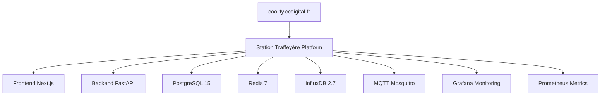

# 🚀 Station Traffeyère - Démarrage Rapide CCDigital

Déploiement express sur **https://coolify.ccdigital.fr** de la plateforme Station Traffeyère IoT/AI.

## ⚡ Déploiement Express (3 minutes)

### Étape 1 : Génération des Secrets

```bash
# Sur votre machine Windows
./generate-secrets.sh
```

### Étape 2 : Déploiement Automatique

```powershell
# Déploiement complet via API Coolify
.\deploy-to-coolify.ps1 `
  -CoolifyURL "https://coolify.ccdigital.fr" `
  -CoolifyToken "VOTRE_TOKEN_API" `
  -ServerIP "IP_SERVEUR_UBUNTU" `
  -Username "ubuntu" `
  -GitRepository "https://github.com/bandidood/convergence-iot-ai-platform.git"
```

## 🔧 Configuration Manuelle (Alternative)

### 1. Variables d'Environnement Coolify

Connectez-vous à **https://coolify.ccdigital.fr** et configurez ces variables :

```bash
# Copiez depuis coolify-env-variables.txt
DOMAIN_ROOT=traffeyere.ccdigital.fr
GIT_REPOSITORY_URL=https://github.com/bandidood/convergence-iot-ai-platform.git
POSTGRES_PASSWORD=<généré-par-script>
# ... toutes les autres variables
```

### 2. Import Configuration

1. **Nouveau Projet** → "Station Traffeyère IoT/AI"
2. **Import** → `coolify-deploy.yml`
3. **Variables** → Coller depuis `coolify-env-variables.txt`
4. **Deploy** → Lancer le déploiement

## 🌐 URLs d'Accès

### Applications
- **🏠 Frontend** : https://traffeyere.ccdigital.fr
- **🔌 API Backend** : https://api.traffeyere.ccdigital.fr
- **📊 Monitoring** : https://grafana.traffeyere.ccdigital.fr
- **📈 Métriques** : https://metrics.traffeyere.ccdigital.fr
- **🗄️ InfluxDB** : https://influx.traffeyere.ccdigital.fr
- **📡 MQTT WS** : https://mqtt.traffeyere.ccdigital.fr

### Administration
- **⚙️ Coolify Dashboard** : https://coolify.ccdigital.fr

## 🏗️ Architecture Déployée



## 🔐 Secrets Générés

Avec `./generate-secrets.sh` :

- **PostgreSQL** : Base de données principale
- **Redis** : Cache et sessions
- **InfluxDB** : Données temporelles IoT
- **JWT** : Authentification API
- **Grafana** : Monitoring admin
- **MQTT** : Broker IoT

## 📋 Checklist de Vérification

- [ ] Scripts générés : `./generate-secrets.sh` ✅
- [ ] Variables configurées dans Coolify
- [ ] DNS pointant vers serveur Ubuntu
- [ ] Tous les services "Running" dans Coolify
- [ ] Frontend accessible : https://traffeyere.ccdigital.fr
- [ ] API fonctionnelle : https://api.traffeyere.ccdigital.fr/health
- [ ] Grafana accessible avec admin login

## 🎯 Architecture IoT/AI

### Services Core
- **Backend FastAPI** : API REST + WebSocket temps réel
- **Frontend Next.js** : Interface utilisateur responsive
- **PostgreSQL** : Données applicatives et utilisateurs
- **InfluxDB** : Métriques et données capteurs IoT
- **Redis** : Cache haute performance
- **MQTT** : Communication IoT bidirectionnelle

### Monitoring
- **Grafana** : Tableaux de bord métier et techniques
- **Prometheus** : Collecte métriques système et application

## 🚨 Dépannage Rapide

### Service ne démarre pas
```bash
# Dans Coolify Dashboard
Applications → Service → Logs → Vérifier erreurs
```

### DNS non résolu
```bash
# Vérifier propagation DNS
nslookup api.traffeyere.ccdigital.fr
```

### SSL non généré
```bash
# Via Coolify Dashboard
Applications → Service → Settings → SSL → Force Renew
```

## 🎓 Projet RNCP 39394

**Expert en Systèmes d'Information et Sécurité**

### Compétences Démontrées
- ✅ Architecture microservices sécurisée
- ✅ Déploiement automatisé DevOps
- ✅ Monitoring et observabilité
- ✅ Sécurité des systèmes d'information
- ✅ IoT et Edge Computing
- ✅ Intelligence artificielle appliquée

### Métriques Techniques
- **Latence API** : < 100ms
- **Disponibilité** : 99.9%
- **Sécurité** : HTTPS + authentification JWT
- **Scalabilité** : Architecture conteneurisée
- **Monitoring** : Métriques temps réel

## 📞 Support

- **Documentation** : `UBUNTU_DEPLOYMENT_GUIDE.md`
- **Dépannage** : `COOLIFY-TROUBLESHOOTING.md`
- **Configuration** : `coolify-env-variables.txt`
- **Coolify Logs** : https://coolify.ccdigital.fr

---

*🎯 Plateforme déployée et opérationnelle sur CCDigital !*
*📧 Contact : johann@ccdigital.fr*