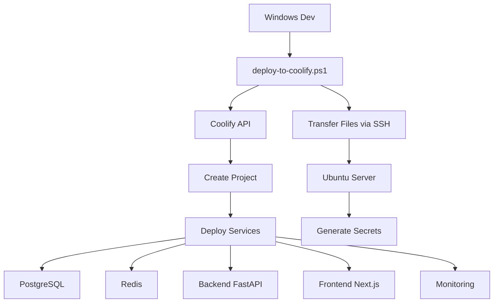

# 🚀 Coolify Existant - Station Traffeyère IoT/AI Platform

Guide pour déployer la plateforme Station Traffeyère sur votre instance Coolify Ubuntu Server déjà installée.

## 🎯 Prérequis

✅ **Serveur Ubuntu** avec Coolify déjà installé  
✅ **Token d'API Coolify** (généré dans Settings > API Keys)  
✅ **Domaine configuré** avec DNS pointant vers votre serveur  
✅ **Accès SSH** au serveur Ubuntu  

## ⚡ Déploiement Express (2 minutes)

### Option 1 : Déploiement Automatique Complet

```powershell
# Depuis Windows, tout en une commande
.\deploy-to-coolify.ps1 `
  -CoolifyURL "https://coolify.votre-serveur.com" `
  -CoolifyToken "votre-token-api" `
  -ServerIP "192.168.1.100" `
  -Username "ubuntu" `
  -KeyPath "C:\chemin\vers\cle.pem"  # Optionnel
```

### Option 2 : Déploiement via Interface Coolify

```powershell
# 1. Transférer les fichiers seulement
.\deploy-to-ubuntu.ps1 -ServerIP "192.168.1.100" -Username "ubuntu"

# 2. Puis déployer via interface web Coolify
# → Ouvrir https://coolify.votre-serveur.com
# → Importer coolify-deploy.yml
```

## 🔧 Configuration Requise

### 1. Obtenir le Token API Coolify

1. Connectez-vous à votre Coolify : `https://coolify.votre-serveur.com`
2. Allez dans **Settings** > **API Keys**
3. Cliquez sur **Generate New Token**
4. Copiez le token généré

### 2. Variables d'Environnement

Le script créera automatiquement le fichier `.env` avec :

```bash
# Domaine principal
DOMAIN_ROOT=votre-domaine.com
ACME_EMAIL=admin@votre-domaine.com

# Secrets (générés automatiquement)
SECRET_KEY=...
JWT_SECRET=...
POSTGRES_PASSWORD=...
REDIS_PASSWORD=...
# ... autres secrets
```

## 🏗️ Architecture de Déploiement



## 📋 Services Déployés

| Service | Type | Domaine | Description |
|---------|------|---------|-------------|
| **PostgreSQL** | Database | - | Base de données principale |
| **Redis** | Cache | - | Cache et sessions |
| **Backend** | Application | `api.votre-domaine.com` | API FastAPI |
| **Frontend** | Application | `votre-domaine.com` | Interface Next.js |
| **InfluxDB** | Database | `influx.votre-domaine.com` | Données temporelles IoT |
| **Grafana** | Monitoring | `grafana.votre-domaine.com` | Tableaux de bord |
| **MQTT** | Message Broker | `mqtt.votre-domaine.com` | Communication IoT |

## 🚀 Exemples d'Usage

### Déploiement Simple

```powershell
.\deploy-to-coolify.ps1 `
  -CoolifyURL "coolify.example.com" `
  -CoolifyToken "coolify_abc123xyz" `
  -ServerIP "203.0.113.10" `
  -Username "ubuntu"
```

### Avec Dépôt Git

```powershell
.\deploy-to-coolify.ps1 `
  -CoolifyURL "coolify.example.com" `
  -CoolifyToken "coolify_abc123xyz" `
  -ServerIP "203.0.113.10" `
  -Username "ubuntu" `
  -GitRepository "https://github.com/username/station-traffeyere.git"
```

### Déploiement Partiel (sans transfert)

```powershell
# Si les fichiers sont déjà sur le serveur
.\deploy-to-coolify.ps1 `
  -CoolifyURL "coolify.example.com" `
  -CoolifyToken "coolify_abc123xyz" `
  -ServerIP "203.0.113.10" `
  -Username "ubuntu" `
  -SkipTransfer
```

## 🔍 Surveillance et Debug

### Via API Coolify

```powershell
# Status des applications
curl -H "Authorization: Bearer YOUR_TOKEN" https://coolify.example.com/api/v1/applications

# Logs d'une application
curl -H "Authorization: Bearer YOUR_TOKEN" https://coolify.example.com/api/v1/applications/APP_ID/logs
```

### Via SSH Ubuntu

```bash
# Connexion au serveur
ssh ubuntu@votre-ip

# Logs des conteneurs
docker ps
docker logs container_name -f

# État des services
systemctl status docker
df -h
```

### Via Interface Coolify

1. **Dashboard** : Vue d'ensemble des services
2. **Applications** : Status et logs de chaque service
3. **Deployments** : Historique des déploiements
4. **Settings** : Configuration DNS, SSL, etc.

## ⚠️ Dépannage Rapide

### Erreur de Connexion API

```powershell
# Vérifier l'URL et le token
curl -H "Authorization: Bearer YOUR_TOKEN" https://coolify.example.com/api/v1/version
```

### Service ne démarre pas

```bash
# Sur le serveur Ubuntu
docker logs service_name
docker restart service_name
```

### Problème SSL/DNS

```bash
# Vérifier DNS
dig +short app.votre-domaine.com

# Forcer le renouvellement SSL via Coolify UI
# → Applications → Service → Settings → SSL → Force Renew
```

## 📚 Fichiers de Configuration

- **`coolify-deploy.yml`** : Configuration complète des services
- **`deploy-to-coolify.ps1`** : Script de déploiement automatisé  
- **`.env`** : Variables d'environnement (généré automatiquement)
- **`docker-compose.prod.yml`** : Configuration Docker (fallback)

## 🎯 Checklist Post-Déploiement

- [ ] Tous les services sont "Running" dans Coolify
- [ ] DNS configuré et propagé (A records)
- [ ] Certificats SSL générés automatiquement
- [ ] Backend accessible via `https://api.votre-domaine.com/health`
- [ ] Frontend accessible via `https://app.votre-domaine.com`
- [ ] Grafana accessible via `https://grafana.votre-domaine.com`
- [ ] Logs sans erreur critique

## 🆘 Support

### Logs Importants

```bash
# Sur le serveur Ubuntu
~/station-traffeyere/ubuntu-setup.log  # Installation
docker-compose logs                     # Services
journalctl -xe                         # Système
```

### URLs Utiles

- **Coolify Dashboard** : `https://coolify.votre-serveur.com`
- **API Documentation** : `https://coolify.io/docs/api`
- **Community** : `https://discord.gg/coolify`

---

## ✨ Avantages Coolify

✅ **Interface Web** intuitive  
✅ **Déploiement Git** automatique  
✅ **SSL automatique** (Let's Encrypt)  
✅ **Monitoring** intégré  
✅ **Backup** automatique  
✅ **Mise à jour** en un clic  
✅ **Rollback** instantané  

---

*🚀 Station Traffeyère prête à décoller avec Coolify !*