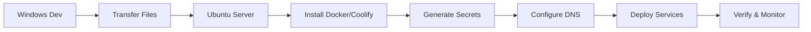

# 🐧 Station Traffeyère - Déploiement Ubuntu Server

Guide de démarrage rapide pour déployer la plateforme Station Traffeyère IoT/AI sur Ubuntu Server avec Coolify.

## 🚀 Démarrage Rapide (5 minutes)

### Étape 1: Transfert depuis Windows
```powershell
# Sur votre poste Windows
.\deploy-to-ubuntu.ps1 -ServerIP "VOTRE_IP" -Username "ubuntu"
```

### Étape 2: Installation sur Ubuntu
```bash
# Sur votre serveur Ubuntu (après transfert)
ssh ubuntu@VOTRE_IP
cd ~/station-traffeyere
./ubuntu-setup.sh --full
```

### Étape 3: Configuration et Déploiement
```bash
# Configurer le domaine dans .env
nano .env  # Modifier DOMAIN_ROOT et ACME_EMAIL

# Déployer avec Coolify
./deploy-coolify.sh
```

## 📋 Workflow Complet



## 🛠️ Scripts Disponibles

| Script | Description | Usage |
|--------|-------------|--------|
| `deploy-to-ubuntu.ps1` | Transfert Windows→Ubuntu | Sur Windows |
| `ubuntu-setup.sh` | Installation complète Ubuntu | Sur Ubuntu |
| `generate-secrets.sh` | Génération des secrets | Sur Ubuntu |
| `deploy-coolify.sh` | Déploiement Coolify | Sur Ubuntu |
| `validate-docker-config.sh` | Validation configuration | Sur Ubuntu |

## 🌐 URLs d'Accès (après déploiement)

- **Application** : `https://app.votre-domaine.com`
- **API Backend** : `https://api.votre-domaine.com`
- **Monitoring** : `https://grafana.votre-domaine.com`
- **Coolify UI** : `https://coolify.votre-domaine.com`

## 🔧 Commandes Utiles Ubuntu

### Monitoring
```bash
# État des services
docker ps
htop
df -h

# Logs en temps réel
docker-compose logs -f
journalctl -f
```

### Maintenance
```bash
# Mise à jour système
sudo apt update && sudo apt upgrade -y

# Nettoyage Docker
docker system prune -f

# Redémarrage des services
docker-compose restart
```

### Sécurité
```bash
# État du firewall
sudo ufw status

# Logs de sécurité
sudo tail -f /var/log/auth.log
sudo fail2ban-client status
```

## 🆘 Dépannage Rapide

### Service ne démarre pas
```bash
# Vérifier les logs
docker-compose logs service_name

# Recréer le service
docker-compose up -d --force-recreate service_name
```

### Problème SSL
```bash
# Vérifier DNS
dig +short app.votre-domaine.com

# Vérifier certificats
docker-compose exec traefik traefik version
```

### Base de données inaccessible
```bash
# Test connexion
docker-compose exec postgres pg_isready

# Logs PostgreSQL
docker-compose logs postgres
```

## 📞 Support

### Documentation Complète
- 📖 **Guide Détaillé** : `UBUNTU_DEPLOYMENT_GUIDE.md`
- 📋 **Guide Général** : `DEPLOYMENT_GUIDE.md`
- 📊 **Résumé Déploiement** : `README-DEPLOYMENT.md`

### Logs Importants
```bash
# Installation Ubuntu
~/station-traffeyere/ubuntu-setup.log

# Services Docker
docker-compose logs

# Système Ubuntu
sudo journalctl -xe
```

### Configuration Minimale Serveur
- **OS** : Ubuntu Server 20.04+ LTS
- **RAM** : 4 GB (8 GB recommandés)
- **Stockage** : 50 GB SSD
- **CPU** : 2 vCPU (4 vCPU recommandés)
- **Réseau** : IP publique + domaine configuré

---

## 🎯 Checklist de Vérification

- [ ] Serveur Ubuntu accessible via SSH
- [ ] Domaine configuré avec DNS
- [ ] Fichiers transférés avec `deploy-to-ubuntu.ps1`
- [ ] Installation complétée avec `ubuntu-setup.sh --full`
- [ ] Variables `.env` configurées
- [ ] Services déployés avec `deploy-coolify.sh`
- [ ] Applications accessibles via HTTPS
- [ ] Monitoring Grafana opérationnel

---

*🚀 Station Traffeyère IoT/AI Platform - Prêt pour Ubuntu Server !*