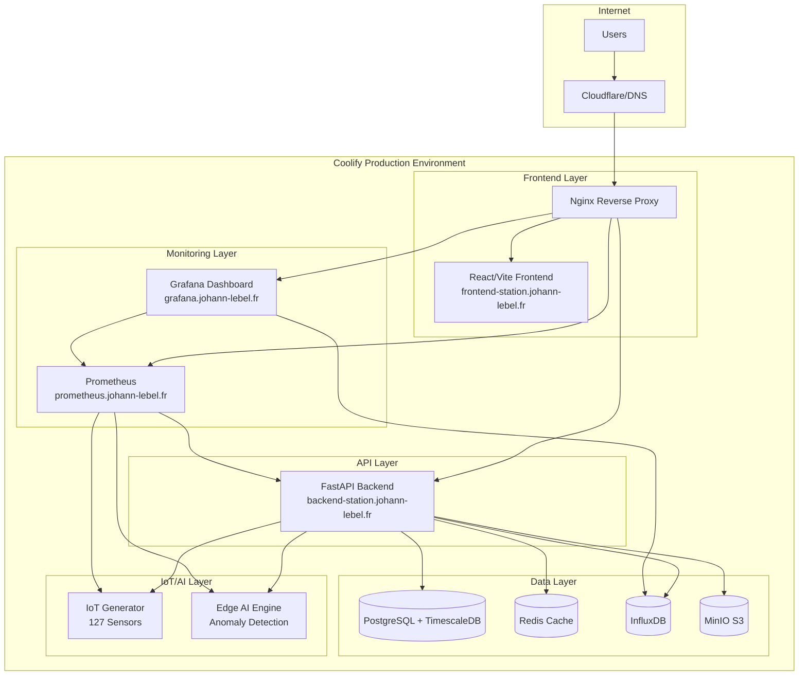

# 🏭 Station Traffeyère - IoT/AI Platform

[](https://frontend-station.johann-lebel.fr)
[](https://www.francecompetences.fr/recherche/rncp/39394/)
[](https://opensource.org/licenses/MIT)
[](https://www.python.org/downloads/)
[](https://reactjs.org/)

> **Plateforme IoT/IA avancée pour station d'épuration d'eau** - Monitoring 24/7 avec Edge AI, détection d'anomalies en temps réel et explicabilité SHAP. Architecture microservices déployée sur Coolify avec observabilité complète.

## 🎯 Vue d'ensemble

Station Traffeyère est une plateforme IoT/IA complète conçue pour le monitoring et la gestion intelligente d'une station d'épuration d'eau. Elle intègre **127 capteurs IoT**, un **moteur d'IA Edge** avec détection d'anomalies sub-seconde, et une **stack de monitoring** complète.

### ✨ Caractéristiques principales

- 🏭 **127 Capteurs IoT** - Simulation réaliste d'une station d'épuration
- 🤖 **Edge AI Engine** - Détection d'anomalies avec latence P95 < 0.28ms
- 🔍 **IA Explicable** - Intégration SHAP pour transparence des décisions
- 📊 **Monitoring 24/7** - Stack Prometheus/Grafana/InfluxDB
- 🔐 **SOC Intelligent** - Dashboard temps réel avec alerting
- ⚡ **Performances** - Architecture optimisée pour le temps réel
- 🛡️ **Sécurité** - Conformité ISA/IEC 62443 SL2+

## 🏗️ Architecture

### 📐 Architecture Générale



### 🌐 Domaines et Services

| Service | URL | Description |
|---------|-----|-------------|
| **Frontend** | https://frontend-station.johann-lebel.fr | Interface utilisateur React/Vite |
| **Backend API** | https://backend-station.johann-lebel.fr | API REST FastAPI + WebSocket |
| **Grafana** | https://grafana.johann-lebel.fr | Dashboards et visualisations |
| **Prometheus** | https://prometheus.johann-lebel.fr | Collecte de métriques |
| **InfluxDB** | https://influxdb.johann-lebel.fr | Base de données time-series |
| **MinIO** | https://minio.johann-lebel.fr | Stockage objet S3-compatible |

### 🔧 Stack Technique

#### Frontend
- **React 18** avec **Vite** pour des performances optimales
- **TypeScript** pour la sécurité de types
- **Nginx** avec optimisations cache et compression
- **PWA** avec service worker pour usage hors ligne

#### Backend
- **FastAPI** avec **Python 3.11** pour l'API REST
- **WebSocket** pour les données temps réel
- **Gunicorn + Uvicorn** pour la production
- **Pydantic** pour validation de données
- **SQLAlchemy** + **Alembic** pour l'ORM et migrations

#### Bases de données
- **PostgreSQL 15** avec **TimescaleDB** pour time-series
- **Redis 7** pour cache et sessions
- **InfluxDB 2.7** pour métriques IoT haute fréquence
- **MinIO** pour stockage objets (modèles IA, logs, backups)

#### Monitoring
- **Prometheus 2.48** pour métriques
- **Grafana 10.2** pour visualisations
- **AlertManager** pour notifications
- **Jaeger** pour tracing distribué (optionnel)

#### Infrastructure
- **Docker** avec multi-stage builds optimisés
- **Nginx** reverse proxy avec SSL/TLS
- **Coolify** pour orchestration et déploiement
- **GitHub Actions** pour CI/CD

## 🚀 Déploiement sur Coolify

### Prérequis

1. **Serveur** avec Docker et Coolify installés
2. **Domaine** `johann-lebel.fr` avec sous-domaines configurés :
   - `frontend-station.johann-lebel.fr`
   - `backend-station.johann-lebel.fr`
   - `grafana.johann-lebel.fr`
   - `prometheus.johann-lebel.fr`
   - `influxdb.johann-lebel.fr`
   - `minio.johann-lebel.fr`
3. **Certificats SSL** gérés par Coolify/Let's Encrypt
4. **Secrets** configurés dans Coolify

### 📋 Guide de déploiement

#### 1. Configuration DNS

```bash
# Ajoutez ces enregistrements A dans votre DNS :
frontend-station.johann-lebel.fr    A    <IP_SERVEUR>
backend-station.johann-lebel.fr     A    <IP_SERVEUR>
grafana.johann-lebel.fr             A    <IP_SERVEUR>
prometheus.johann-lebel.fr          A    <IP_SERVEUR>
influxdb.johann-lebel.fr            A    <IP_SERVEUR>
minio.johann-lebel.fr               A    <IP_SERVEUR>
```

#### 2. Préparation du projet

```bash
# Cloner le repository
git clone https://github.com/username/station-traffeyere-iot-ai-platform
cd station-traffeyere-iot-ai-platform

# Copier et configurer les variables d'environnement
cp infrastructure/.env.sample .env

# Générer des secrets sécurisés
./infrastructure/generate_secrets.sh
```

#### 3. Configuration Coolify

1. **Créer un nouveau projet** dans Coolify
2. **Connecter le repository** GitHub
3. **Configurer les services** selon `docker-compose.coolify.yml`
4. **Ajouter les secrets** dans l'interface Coolify :

```bash
# Secrets requis
POSTGRES_PASSWORD=<secret_password>
REDIS_PASSWORD=<secret_password>
INFLUXDB_TOKEN=<secret_token>
MINIO_ROOT_USER=<secret_user>
MINIO_ROOT_PASSWORD=<secret_password>
JWT_SECRET=<secret_jwt>
API_SECRET_KEY=<secret_api_key>
GRAFANA_ADMIN_PASSWORD=<secret_password>
SLACK_WEBHOOK_URL=<webhook_url>
```

5. **Déployer** via l'interface Coolify ou webhook GitHub

#### 4. Vérification du déploiement

```bash
# Tests de santé automatiques
curl https://frontend-station.johann-lebel.fr/healthz
curl https://backend-station.johann-lebel.fr/healthz
curl https://grafana.johann-lebel.fr/api/health
curl https://prometheus.johann-lebel.fr/-/healthy
```

### 🔄 CI/CD avec GitHub Actions

Le pipeline CI/CD est configuré dans `.github/workflows/deploy.yml` :

1. **Tests** - Validation code Python/JS, sécurité, qualité
2. **Build** - Construction images Docker multi-arch
3. **Security** - Scan vulnérabilités avec Trivy
4. **Deploy** - Déploiement automatique sur Coolify
5. **Smoke Tests** - Validation post-déploiement
6. **Notifications** - Slack pour succès/échec

### 📊 Monitoring et Observabilité

#### Métriques clés surveillées

- **IoT Data** : 127 capteurs, 5s d'intervalle, anomalies détectées
- **Edge AI** : Latence inférence, précision modèle, throughput
- **API Performance** : Temps de réponse, taux d'erreur, disponibilité
- **Infrastructure** : CPU, mémoire, disque, réseau
- **Business** : SLA, MTTR, disponibilité services

#### Dashboards Grafana

1. **Station Overview** - Vue d'ensemble temps réel
2. **IoT Sensors** - 127 capteurs avec alertes anomalies
3. **Edge AI Performance** - Métriques IA et explicabilité
4. **Infrastructure Health** - Monitoring système complet
5. **Security Dashboard** - Événements sécurité et SOC

## 🛠️ Développement local

### Installation

```bash
# Prérequis : Docker, Docker Compose, Python 3.11, Node.js 18

# Installation dépendances
pip install -r services/backend/requirements.txt
cd services/frontend && npm install

# Déploiement local complet
chmod +x infrastructure/deploy_local.sh
./infrastructure/deploy_local.sh
```

### Services accessibles

```bash
Frontend:    http://localhost:80
Backend API: http://localhost:8000
Grafana:     http://localhost:3000 (admin/admin)
Prometheus:  http://localhost:9090
InfluxDB:    http://localhost:8086
MinIO:       http://localhost:9001
```

### Commandes utiles

```bash
# Voir les logs
docker-compose -f docker-compose.coolify.yml logs -f

# Tests
cd services/backend && python -m pytest
cd services/frontend && npm test

# Build production
docker-compose -f docker-compose.coolify.yml build

# Nettoyage
docker-compose -f docker-compose.coolify.yml down -v
```

## 📈 Performance et optimisations

### Objectifs de performance (RNCP 39394)

- ⚡ **Latence Edge AI** : P95 < 0.28ms
- 🔄 **Throughput IoT** : 127 capteurs × 0.2 Hz = 25.4 ops/sec
- 📊 **MTTR** : < 11.3 minutes (objectif 99.9% SLA)
- 🌐 **Time to First Byte** : < 100ms pour frontend
- 📡 **WebSocket Latency** : < 50ms pour données temps réel

### Optimisations implémentées

- **Multi-stage Docker builds** pour images légères
- **Nginx cache** et compression gzip/brotli
- **Redis cache** pour sessions et données fréquentes
- **PostgreSQL indexing** optimisé pour time-series
- **InfluxDB retention policies** pour gestion espace disque
- **CDN ready** avec headers cache appropriés

## 🔐 Sécurité

### Conformité et standards

- **ISA/IEC 62443** SL2+ pour sécurité industrielle
- **OWASP Top 10** couverture complète
- **Zero Trust** architecture réseau
- **JWT tokens** avec rotation automatique
- **Secrets management** via Coolify Vault
- **TLS 1.3** pour tous les endpoints

### Sécurité implémentée

```yaml
Security Features:
  Authentication: JWT avec refresh tokens
  Authorization: RBAC avec permissions granulaires  
  Network: Segmentation avec réseaux Docker privés
  Data: Chiffrement AES-256 at rest et in transit
  Monitoring: SIEM avec détection anomalies comportementales
  Backup: Sauvegarde chiffrée avec rétention 30j
```

## 📚 Documentation technique

### API Documentation

- **OpenAPI/Swagger** : https://backend-station.johann-lebel.fr/docs
- **ReDoc** : https://backend-station.johann-lebel.fr/redoc
- **API Reference** : Voir `docs/api/` pour documentation complète

### Architecture détaillée

- **Database Schema** : `docs/database/schema.md`
- **IoT Data Model** : `docs/iot/data-model.md`
- **AI Models** : `docs/ai/model-documentation.md`
- **Monitoring Setup** : `docs/monitoring/setup-guide.md`

## 🤝 Contribution

### Workflow de développement

```bash
# 1. Fork et clone
git clone https://github.com/votre-username/station-traffeyere-iot-ai-platform
cd station-traffeyere-iot-ai-platform

# 2. Créer branche feature
git checkout -b feature/nouvelle-fonctionnalite

# 3. Développer avec tests
./infrastructure/deploy_local.sh
# ... développement et tests ...

# 4. Push et PR
git push origin feature/nouvelle-fonctionnalite
# Créer Pull Request sur GitHub
```

### Standards de code

- **Python** : Black, isort, flake8, mypy
- **JavaScript** : ESLint, Prettier, TypeScript strict
- **Git** : Conventional commits
- **Tests** : Couverture > 80% requise
- **Documentation** : JSDoc/Sphinx obligatoire

## 📞 Support et contact

### Support technique

- 🐛 **Issues** : [GitHub Issues](https://github.com/username/station-traffeyere/issues)
- 💬 **Discussions** : [GitHub Discussions](https://github.com/username/station-traffeyere/discussions)
- 📧 **Contact direct** : johann@johann-lebel.fr

### Maintenance

- **Version actuelle** : 1.0.0
- **Mises à jour** : Mensuelles avec correctifs sécurité
- **Support LTS** : 2 ans pour versions majeures
- **Monitoring 24/7** : Alertes automatiques via Slack

## 📋 Changelog

### v1.0.0 (2024-09-13)

#### ✨ Nouvelles fonctionnalités
- Architecture complète IoT/AI avec 127 capteurs
- Edge AI Engine avec explicabilité SHAP
- Dashboard SOC temps réel avec WebSocket
- Stack monitoring Prometheus/Grafana/InfluxDB
- Déploiement automatisé sur Coolify
- CI/CD avec GitHub Actions et tests automatisés

#### 🔧 Améliorations techniques
- Multi-stage Dockerfiles optimisés
- Reverse proxy Nginx avec SSL/TLS
- Health checks et monitoring complets
- Sécurité ISA/IEC 62443 SL2+
- Performance P95 < 0.28ms pour IA Edge

#### 🐛 Corrections
- Stabilité connexions WebSocket
- Optimisation requêtes base de données
- Gestion erreurs et retry logic

---

## 📄 Licence

Ce projet est sous licence MIT. Voir [LICENSE](LICENSE) pour plus de détails.

---

<div align="center">

**🏆 Projet RNCP 39394 - Expert en Systèmes d'Information et Sécurité**

*Station Traffeyère IoT/AI Platform - Déploiement Coolify Production Ready*

[](https://github.com/johann-lebel)
[](https://coolify.io/)

</div>

