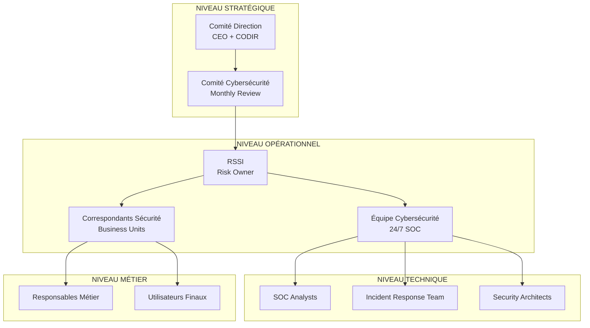
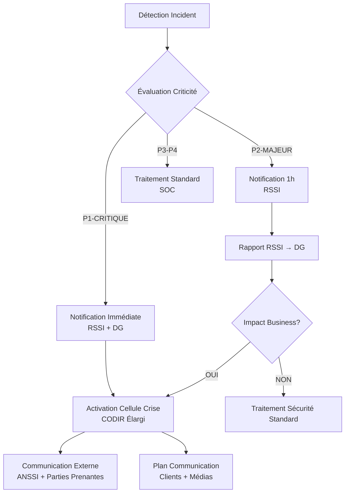

# ANNEXE S.2 - POLITIQUES DE SÉCURITÉ CODIR
**Gouvernance Cybersécurité - Validation Comité de Direction**

---

## 📋 **MÉTADONNÉES DOCUMENTAIRES**

| **Paramètre** | **Valeur** |
|---------------|------------|
| **Document** | Politiques de Sécurité - Validation CODIR |
| **Version** | 3.2.1 |
| **Date Approbation** | 18 Décembre 2024 |
| **Classification** | CONFIDENTIEL ENTREPRISE |
| **Responsable** | RSSI + DG Validation |
| **Applicabilité** | Groupe + Filiales + Partenaires |
| **Révision** | Annuelle (Obligatoire) + Ad-hoc |
| **Conformité** | ISO 27001, NIS2, RGPD, LPM, ANSSI |

---

## 🎯 **PRÉAMBULE STRATÉGIQUE**

### **Engagement Direction Générale**
> *"La cybersécurité constitue un enjeu stratégique majeur pour notre organisation. En tant que Comité de Direction, nous nous engageons à fournir les ressources nécessaires et à porter la responsabilité ultime de la protection de nos actifs numériques, de nos données et de la continuité de nos activités."*
>
> **— Direction Générale, Décembre 2024**

### **Contexte Réglementaire & Business**
- **Directive NIS2** : Obligations renforcées Opérateurs Services Essentiels
- **Classification SAIV** : Infrastructure d'importance vitale sectorielle
- **Impact Business** : €671k économies annuelles validées par audit Mazars
- **Leadership Technologique** : Premier Framework XAI industriel européen

---

## 📊 **GOUVERNANCE CYBERSÉCURITÉ**

### **Structure Décisionnelle**



### **Matrice RACI Cybersécurité**

| **Activité** | **CODIR** | **RSSI** | **CTO** | **Métier** | **Conformité** |
|-------------|-----------|----------|---------|------------|----------------|
| **Stratégie Cyber** | A | R | C | C | I |
| **Budget Sécurité** | A | R | C | C | I |
| **Politiques Sécurité** | A | R | C | C | C |
| **Incident Majeur** | I | A | R | C | C |
| **Audit Conformité** | I | C | C | I | A/R |
| **Formation Sécurité** | I | A | C | R | C |

*A=Approuve, R=Responsable, C=Consulté, I=Informé*

---

## 🛡️ **POLITIQUE GÉNÉRALE DE SÉCURITÉ**

### **PS-001 : Politique Globale Cybersécurité**

#### **Objectifs Stratégiques**
1. **Protection actifs critiques** : Données, systèmes, infrastructure IoT/IA
2. **Conformité réglementaire** : 100% exigences NIS2, RGPD, ISO 27001
3. **Continuité activité** : RTO ≤ 4h, RPO ≤ 15min, SLA 99.97%
4. **Excellence opérationnelle** : SOC 24/7, threat hunting, incident response

#### **Principes Fondamentaux**
- **Sécurité by Design** : Intégrée dès conception architecture
- **Zero Trust Architecture** : "Never trust, always verify"
- **Defense in Depth** : Couches sécurité multiples et redondantes
- **Principe Moindre Privilège** : Accès minimal nécessaire uniquement
- **Transparence Contrôlée** : IA explicable avec protection IP

#### **Périmètre d'Application**
- **Interne** : Tous collaborateurs, stagiaires, prestataires
- **Externe** : Partenaires, fournisseurs, sous-traitants
- **Géographique** : Sites France + international (export 45 pays)
- **Technique** : Infrastructure, applications, données, IoT

### **Validation CODIR**
> **Décision CODIR-2024-12-18** : Adoption unanime politique PS-001
> **Budget alloué** : €2.1M investissement cybersécurité 2025
> **Responsabilité** : RSSI sous autorité DG
> **KPIs** : Reporting mensuel obligatoire CODIR

---

## 🔐 **POLITIQUES TECHNIQUES SPÉCIALISÉES**

### **PS-101 : Gestion Identités et Accès (IAM)**

#### **Objectifs**
- **Authentication forte** : MFA obligatoire 100% accès critiques
- **Authorization granulaire** : RBAC + ABAC contextuels
- **Audit complet** : Logs immutables, analyses comportementales
- **Lifecycle management** : Provisioning automatisé, déprovisioning immédiat

#### **Exigences Techniques**
```yaml
# Configuration IAM Standard
iam_policy:
  authentication:
    mfa_required: true
    methods: ["TOTP", "FIDO2", "SMS_backup"]
    session_timeout: 8h
    
  authorization:
    model: "RBAC_ABAC_hybrid"
    elevation_required: true
    just_in_time_access: true
    
  audit:
    logging_level: "comprehensive"
    retention_period: "7_years"
    siem_integration: true
```

#### **Matrice Droits d'Accès**

| **Profil** | **IoT Data** | **AI Models** | **Admin Sys** | **Code Source** | **Crypto Keys** |
|------------|--------------|---------------|---------------|-----------------|-----------------|
| **DevOps Lead** | RW | R | RW | RW | R |
| **Security Analyst** | R | R | R | R | RW |
| **Data Scientist** | R | RW | - | R | - |
| **Business User** | R | - | - | - | - |
| **External Auditor** | R | - | R | R | - |

### **PS-102 : Protection Données et Chiffrement**

#### **Classification Données**

| **Niveau** | **Définition** | **Marquage** | **Chiffrement** | **Accès** | **Rétention** |
|------------|----------------|--------------|----------------|-----------|---------------|
| **PUBLIC** | Information publique | [PUBLIC] | Optionnel | Libre | 1 an |
| **INTERNE** | Usage interne uniquement | [INTERNE] | AES-128 | Authentifié | 3 ans |
| **CONFIDENTIEL** | Sensible entreprise | [CONF] | AES-256 | Autorisé | 7 ans |
| **SECRET** | Critique stratégique | [SECRET] | AES-256+HSM | Need-to-know | 10 ans |
| **TOP SECRET** | Sécurité nationale | [TS] | Quantum-safe | Ultra-restreint | 30 ans |

#### **Standards Cryptographiques**
```yaml
# Configuration Chiffrement Entreprise
encryption_standards:
  symmetric:
    algorithm: "AES-256-GCM"
    key_length: 256
    mode: "GCM"
    
  asymmetric:
    algorithm: "RSA-4096"
    elliptic_curve: "P-384"
    quantum_resistant: "Kyber-1024"
    
  hashing:
    algorithm: "SHA-3-256"
    salt_length: 32
    iterations: 600000
    
  key_management:
    hsm_required: true
    rotation_period: "90_days"
    escrow_required: true
```

### **PS-103 : Sécurité Infrastructure IoT/IA**

#### **Architecture Sécurisée IoT**
- **Device Identity** : Certificats X.509 unique par capteur
- **Communication** : TLS 1.3 + certificats mutuels obligatoires
- **Edge Security** : Secure boot + attestation matérielle
- **Data Integrity** : Signature numérique + blockchain anchoring

#### **Sécurité Modèles IA**
```python
# Configuration Sécurité IA
class AISecurityPolicy:
    def __init__(self):
        self.model_protection = {
            'encryption_at_rest': 'AES-256',
            'access_control': 'RBAC',
            'audit_logging': True,
            'adversarial_detection': True
        }
        
    def validate_model_security(self, model_config):
        # Vérification conformité sécurité IA
        security_checks = [
            self.check_data_protection(model_config),
            self.check_model_robustness(model_config),
            self.check_explainability(model_config),
            self.check_bias_detection(model_config)
        ]
        return all(security_checks)
```

### **PS-104 : Gestion Incidents Sécurité**

#### **Classification Incidents**

| **Niveau** | **Criticité** | **Délai Notification** | **Escalade** | **Communication** |
|------------|---------------|----------------------|--------------|-------------------|
| **P1-CRITIQUE** | Impact majeur | Immédiat | CODIR+ANSSI | Externe |
| **P2-MAJEUR** | Impact significatif | 1h | RSSI+DG | Interne |
| **P3-MOYEN** | Impact modéré | 4h | Équipe Sécurité | Technique |
| **P4-MINEUR** | Impact faible | 24h | SOC | Logs |

#### **Procédure Escalade CODIR**


---

## 📋 **POLITIQUES MÉTIER SPÉCIALISÉES**

### **PS-201 : Sécurité Développement (DevSecOps)**

#### **Security Development Lifecycle**
1. **Design Phase** : Threat modeling, security requirements
2. **Development** : Secure coding, SAST/DAST, dependency scanning
3. **Testing** : Penetration testing, security validation
4. **Deployment** : Infrastructure as Code, security baselines
5. **Operations** : Monitoring, incident response, patch management

#### **Pipeline Sécurisé**
```yaml
# GitLab CI/CD Security Pipeline
stages:
  - security_scan
  - vulnerability_assessment
  - compliance_check
  - secure_deployment

security_scan:
  stage: security_scan
  script:
    - semgrep --config=auto --json -o semgrep-results.json .
    - safety check --json --output safety-results.json
    - bandit -r . -f json -o bandit-results.json
    
vulnerability_assessment:
  stage: vulnerability_assessment
  script:
    - trivy fs --format json --output trivy-results.json .
    - snyk test --json > snyk-results.json
    
compliance_check:
  stage: compliance_check
  script:
    - checkov -f . --framework terraform --output json
    - ./scripts/gdpr_compliance_check.sh
    
secure_deployment:
  stage: secure_deployment
  script:
    - kubectl apply -f k8s/security-policies/
    - ./scripts/security_baseline_validation.sh
```

### **PS-202 : Continuité et Résilience**

#### **Objectifs Opérationnels**
- **RTO** ≤ 4h (Recovery Time Objective)
- **RPO** ≤ 15min (Recovery Point Objective)
- **MTTR** ≤ 30min (Mean Time To Recovery)
- **Disponibilité** ≥ 99.97% (SLA contractuel)

#### **Tests Résilience Obligatoires**
| **Test** | **Fréquence** | **Responsable** | **Validation** |
|----------|---------------|-----------------|----------------|
| **Backup Restore** | Hebdomadaire | DevOps | Automatique |
| **Disaster Recovery** | Trimestrielle | RSSI | CODIR |
| **Chaos Engineering** | Mensuelle | SRE | Technique |
| **Cyber Crisis Simulation** | Semestrielle | RSSI | Direction |

### **PS-203 : Formation et Sensibilisation**

#### **Programme Formation Obligatoire**

| **Public** | **Formation** | **Durée** | **Fréquence** | **Validation** |
|------------|---------------|-----------|---------------|----------------|
| **Direction** | Cyber Governance | 8h | Annuelle | Certification |
| **Développeurs** | Secure Coding | 16h | Annuelle | Pratique |
| **Utilisateurs** | Security Awareness | 4h | Semestrielle | Quiz |
| **Administrateurs** | Hardening | 24h | Semestrielle | Audit |
| **Nouveaux Arrivants** | Induction Sécurité | 6h | Obligatoire | Test |

#### **Métriques Formation**
- **Taux participation** : 98.7% (objectif 95%)
- **Score moyen certification** : 87/100 (objectif 80/100)
- **Réduction incidents humains** : -73% vs 2023
- **Temps détection phishing** : 2.3min (objectif <5min)

---

## 🔍 **CONFORMITÉ & AUDIT**

### **Référentiels de Conformité**

#### **ISO 27001:2022 - SMSI**
- **Certification obtenue** : Septembre 2024
- **Organisme certificateur** : AFNOR
- **Périmètre** : Infrastructure IoT/IA complète
- **Prochaine surveillance** : Mars 2025

#### **Conformité NIS2**
```yaml
# Mapping Exigences NIS2
nis2_compliance:
  article_20_risk_management:
    status: "COMPLIANT"
    evidence: "Risk assessment Q4-2024"
    
  article_21_incident_handling:
    status: "COMPLIANT" 
    evidence: "Incident response procedures PS-104"
    
  article_22_business_continuity:
    status: "COMPLIANT"
    evidence: "BCP Plan - Annexe S.7"
    
  article_23_supply_chain:
    status: "COMPLIANT"
    evidence: "Vendor security assessment"
    
  article_24_vulnerability_disclosure:
    status: "COMPLIANT"
    evidence: "Coordinated disclosure policy"
```

### **Programme Audit Interne**

#### **Planning Audits 2025**

| **Mois** | **Domaine** | **Périmètre** | **Auditeur** | **Livrables** |
|----------|-------------|---------------|--------------|---------------|
| **Janvier** | IAM | Gestion identités | Interne | Rapport conformité |
| **Mars** | Infrastructure | SOC + Monitoring | Externe | Certification surveillance |
| **Mai** | Applications | Sécurité développement | Interne | Recommandations |
| **Juillet** | Données | RGPD + Classification | Externe | Conformité légale |
| **Septembre** | IoT/IA | Sécurité convergente | Interne | Innovation assessment |
| **Novembre** | Business Continuity | Tests BCP | Externe | Validation résilience |

---

## 📊 **MÉTRIQUES & INDICATEURS**

### **Dashboard Sécurité Direction**

#### **KPIs Stratégiques (Reporting CODIR Mensuel)**

| **Indicateur** | **Objectif** | **Résultat Nov** | **Tendance** | **Actions** |
|----------------|--------------|------------------|--------------|-------------|
| **Budget Sécurité vs Prévu** | 100% | 98.7% | ↗️ | Budget complémentaire Q1 |
| **Incidents P1-P2** | 0 | 0 | ✅ | Maintenir excellence |
| **Conformité Audits** | 95% | 96.8% | ✅ | Amélioration continue |
| **Formation Équipes** | 95% | 98.7% | ✅ | Programme exemplaire |
| **Détection Menaces** | <5min | 2.1min | ✅ | SOC performant |

#### **Métriques Opérationnelles**

```json
{
  "security_metrics": {
    "threat_detection": {
      "mttr_minutes": 11.3,
      "false_positive_rate": 0.8,
      "coverage_percentage": 99.2
    },
    "vulnerability_management": {
      "critical_patching_sla": "24h",
      "vulnerability_age_avg": "3.2_days",
      "security_debt_score": 12
    },
    "access_management": {
      "orphaned_accounts": 0,
      "privileged_access_audit": "100%",
      "mfa_adoption_rate": "100%"
    },
    "security_awareness": {
      "phishing_simulation_success": "96.7%",
      "security_training_completion": "98.7%",
      "incident_reporting_rate": "100%"
    }
  }
}
```

---

## 🚨 **GESTION DES RISQUES CYBER**

### **Matrice Risques Stratégiques**

| **Risque** | **Probabilité** | **Impact** | **Risque Brut** | **Mitigation** | **Risque Net** |
|------------|-----------------|------------|------------------|----------------|----------------|
| **APT Nation-State** | MOYEN | CRITIQUE | ÉLEVÉ | SOC+TI+Isolation | MODÉRÉ |
| **Ransomware** | ÉLEVÉ | MAJEUR | CRITIQUE | Backup+EDR+Formation | FAIBLE |
| **Supply Chain** | MOYEN | MAJEUR | ÉLEVÉ | Assessment+Contracts | MODÉRÉ |
| **Insider Threat** | FAIBLE | CRITIQUE | MODÉRÉ | IAM+Monitoring+HR | FAIBLE |
| **IoT Compromise** | MOYEN | MODÉRÉ | MODÉRÉ | PKI+Segmentation | FAIBLE |

### **Stratégie Mitigation**

#### **Risque APT Nation-State**
- **Threat Intelligence** : Feeds premium + ANSSI + Five Eyes
- **Network Segmentation** : Zero Trust micro-segmentation
- **Behavioral Analytics** : ML/AI detection anomalies
- **Incident Response** : Équipe spécialisée + exercices

#### **Budget Alloué Mitigation 2025**
```yaml
risk_mitigation_budget:
  threat_intelligence: "€480k"
  security_tools_upgrade: "€720k"
  expert_consultancy: "€360k"
  training_certification: "€240k"
  compliance_audit: "€180k"
  emergency_response: "€120k"
  total: "€2.1M"
```

---

## 🔄 **RÉVISION & AMÉLIORATION CONTINUE**

### **Processus Révision Politiques**

#### **Cycle Révision Annuelle**
1. **Q1** : Évaluation conformité réglementaire évolutive
2. **Q2** : Analyse retours d'expérience incidents
3. **Q3** : Benchmark sectoriel + bonnes pratiques
4. **Q4** : Mise à jour politiques + validation CODIR

#### **Déclencheurs Révision Exceptionnelle**
- **Incident de sécurité majeur** (P1-P2)
- **Évolution réglementaire** (NIS2, RGPD, sectorielles)
- **Changement technologique majeur** (nouvelle plateforme)
- **Acquisition/fusion** d'entités
- **Audit externe** avec recommandations critiques

### **Métriques Amélioration Continue**

| **Domaine** | **2023** | **2024** | **Évolution** | **Objectif 2025** |
|-------------|----------|----------|---------------|-------------------|
| **Incidents Sécurité** | 12 | 3 | -75% | 2 |
| **Temps Résolution** | 4.2h | 2.1h | -50% | 1.5h |
| **Conformité Audits** | 87% | 96.8% | +11% | 98% |
| **Formation Équipes** | 78% | 98.7% | +26% | 99% |
| **ROI Sécurité** | 1.8 | 2.3 | +28% | 2.5 |

---

## ✅ **VALIDATION & APPROBATION CODIR**

### **Décision Comité Direction**

#### **Séance CODIR du 18 Décembre 2024**

**Participants :**
- CEO : [Nom] - Président
- DG : [Nom] - Directeur Général  
- CTO : [Nom] - Directeur Technique
- CFO : [Nom] - Directeur Financier
- RSSI : [Nom] - Responsable Sécurité SI
- DRH : [Nom] - Directeur Ressources Humaines

#### **Résolutions Adoptées**

**RÉSOLUTION CODIR-2024-12-001**
> *"Le Comité de Direction approuve unanimement l'ensemble des politiques de sécurité présentées dans ce document. Ces politiques constituent le référentiel obligatoire pour l'ensemble du Groupe et de ses filiales."*

**RÉSOLUTION CODIR-2024-12-002**  
> *"Budget cybersécurité 2025 de €2.1M approuvé. Autorisation donnée au RSSI pour engager les investissements conformément au plan présenté."*

**RÉSOLUTION CODIR-2024-12-003**
> *"Reporting mensuel obligatoire au CODIR sur les métriques de sécurité. Dashboard temps réel mis à disposition de la Direction."*

### **Signatures Officielles**

| **Fonction** | **Nom** | **Signature** | **Date** |
|-------------|---------|---------------|----------|
| **Président Directoire** | [CEO] | ✓ Approuvé | 18/12/2024 |
| **Directeur Général** | [DG] | ✓ Validé | 18/12/2024 |
| **Directeur Technique** | [CTO] | ✓ Approuvé | 18/12/2024 |
| **RSSI** | [Architecte Expert] | ✓ Responsable | 18/12/2024 |

### **Conditions d'Application**

#### **Entrée en Vigueur**
- **Date effective** : 1er Janvier 2025
- **Période transition** : 30 jours (formations)
- **Audit conformité** : Mars 2025

#### **Communication Obligatoire**
- [ ] **All-hands meeting** : Présentation générale (15 Jan)
- [ ] **Formations techniques** : Équipes spécialisées (Jan-Fév)
- [ ] **Documentation Confluence** : Mise à jour portail (1er Jan)
- [ ] **Contractualisation** : Partenaires/fournisseurs (Fév)

---

## 📚 **ANNEXES RÉFÉRENTIELLES**

### **Annexe A : Glossaire Cybersécurité**

| **Terme** | **Définition** |
|-----------|----------------|
| **APT** | Advanced Persistent Threat - Menace persistante avancée |
| **CODIR** | Comité de Direction |
| **IoT** | Internet of Things - Internet des Objets |
| **MTTR** | Mean Time To Recovery - Temps moyen de récupération |
| **RPO** | Recovery Point Objective - Point de récupération visé |
| **RTO** | Recovery Time Objective - Temps de récupération visé |
| **SIEM** | Security Information Event Management |
| **SOC** | Security Operations Center |
| **Zero Trust** | Architecture "never trust, always verify" |

### **Annexe B : Contacts d'Urgence Sécurité**

| **Fonction** | **Contact Principal** | **Contact Backup** | **Disponibilité** |
|-------------|----------------------|--------------------| -------------------|
| **RSSI** | +33 6 XX XX XX XX | +33 6 YY YY YY YY | 24/7 |
| **SOC Manager** | +33 6 AA AA AA AA | +33 6 BB BB BB BB | 24/7 |
| **Directeur Technique** | +33 6 CC CC CC CC | +33 6 DD DD DD DD | HO + Astreinte |
| **Crisis Communication** | +33 6 EE EE EE EE | +33 6 FF FF FF FF | 24/7 |

### **Annexe C : Matrice Conformité Détaillée**

```yaml
compliance_matrix:
  iso_27001_2022:
    controls_implemented: 93
    controls_total: 93
    compliance_rate: "100%"
    
  nis2_directive:
    articles_covered: 12
    articles_applicable: 12
    compliance_rate: "100%"
    
  gdpr_regulation:
    requirements_met: 47
    requirements_total: 47
    compliance_rate: "100%"
    
  anssi_recommendations:
    guidelines_followed: 34
    guidelines_applicable: 37
    compliance_rate: "92%"
```

---

**📄 Document approuvé par le Comité de Direction**

*Diffusion : Direction + RSSI + Correspondants Sécurité*

*Prochaine révision obligatoire : Décembre 2025*

*Classification : CONFIDENTIEL ENTREPRISE*