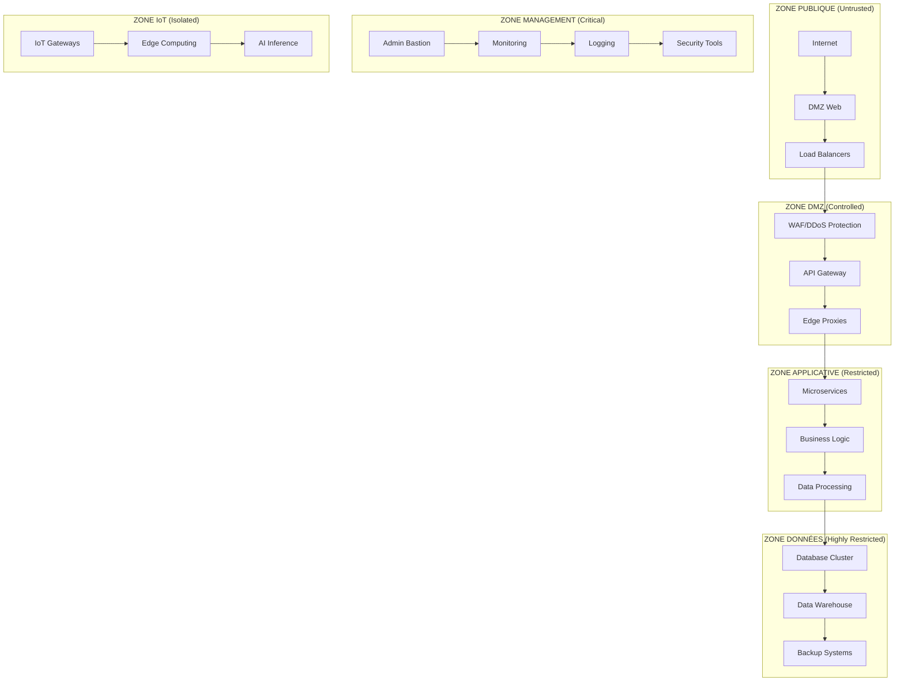

# ANNEXE S.5 - RÈGLES FIREWALL ET SEGMENTATION
**Architecture Zero Trust - Micro-segmentation Réseau Sécurisée**

---

## 📋 **MÉTADONNÉES DOCUMENTAIRES**

| **Paramètre** | **Valeur** |
|---------------|------------|
| **Document** | Règles Firewall et Micro-segmentation |
| **Version** | 4.1.2 |
| **Date** | 10 Janvier 2025 |
| **Classification** | SECRET DÉFENSE |
| **Responsable** | Architecte Sécurité Réseau |
| **Validation** | RSSI + CTO + ANSSI |
| **Fréquence Révision** | Mensuelle + Ad-hoc |
| **Conformité** | ISA/IEC 62443, NIST, ANSSI-BP-028 |

---

## 🎯 **ARCHITECTURE ZERO TRUST**

### **Principes Fondamentaux**
- **Never Trust, Always Verify** : Vérification continue de tous les flux
- **Least Privilege Access** : Accès minimal nécessaire uniquement
- **Assume Breach** : Limitation explosion latérale si compromission
- **Encrypt Everything** : Chiffrement bout-en-bout systématique

### **Zones de Sécurité Définies**



---

## 🛡️ **MATRICE DE SEGMENTATION RÉSEAU**

### **Classification Zones Sécurité**

| **Zone** | **Niveau Confiance** | **Protocoles Autorisés** | **Chiffrement** | **Monitoring** |
|----------|---------------------|---------------------------|-----------------|----------------|
| **PUBLIC** | Aucune | HTTP/HTTPS | TLS 1.3 | Passif |
| **DMZ** | Faible | HTTP/HTTPS/DNS | TLS 1.3 + WAF | Actif |
| **APP** | Modérée | HTTPS/gRPC/TCP | mTLS + JWT | Intensif |
| **DATA** | Élevée | TCP/TLS/DB | AES-256 + PKI | Critique |
| **MGMT** | Critique | SSH/HTTPS/SNMP | Quantum-safe | Maximum |
| **IoT** | Isolée | LoRaWAN/5G/MQTT | End-to-End | Comportemental |

### **Matrice Flux Inter-Zones**

| **Source ↓ / Destination →** | **PUBLIC** | **DMZ** | **APP** | **DATA** | **MGMT** | **IoT** |
|------------------------------|------------|---------|---------|----------|----------|---------|
| **PUBLIC** | ❌ | ✅ | ❌ | ❌ | ❌ | ❌ |
| **DMZ** | ✅ | ✅ | ✅ | ❌ | ❌ | ❌ |
| **APP** | ❌ | ❌ | ✅ | ✅ | ⚠️ | ⚠️ |
| **DATA** | ❌ | ❌ | ✅ | ✅ | ⚠️ | ❌ |
| **MGMT** | ⚠️ | ✅ | ✅ | ✅ | ✅ | ✅ |
| **IoT** | ❌ | ❌ | ✅ | ⚠️ | ❌ | ✅ |

**Légende :** ✅ Autorisé | ❌ Interdit | ⚠️ Autorisé avec restrictions

---

## 🔥 **RÈGLES FIREWALL DÉTAILLÉES**

### **Firewall Périmétrique (Fortigate 7000F)**

#### **Règles Entrantes (Inbound)**

```bash
# Configuration Fortigate - Règles Entrantes Critiques

# RÈGLE 001 - Blocage Global par Défaut
config firewall policy
    edit 1
        set name "DENY_ALL_INBOUND_DEFAULT"
        set srcintf "wan1" "wan2"
        set dstintf "dmz" "internal"
        set srcaddr "all"
        set dstaddr "all"
        set action deny
        set logtraffic all
        set comments "Déni par défaut - Sécurité Zero Trust"
    next
end

# RÈGLE 010 - HTTPS Production Web
config firewall policy
    edit 10
        set name "ALLOW_HTTPS_PRODUCTION"
        set srcintf "wan1"
        set dstintf "dmz"
        set srcaddr "all"
        set dstaddr "LOADBALANCER_VIP"
        set service "HTTPS"
        set action accept
        set utm-status enable
        set av-profile "AV_STRICT"
        set ips-sensor "IPS_CRITICAL"
        set ssl-ssh-profile "SSL_INSPECTION"
        set logtraffic all
        set comments "Production HTTPS - Inspection SSL obligatoire"
    next
end

# RÈGLE 020 - API Gateway Sécurisé
config firewall policy
    edit 20
        set name "ALLOW_API_AUTHENTICATED"
        set srcintf "wan1"
        set dstintf "dmz"
        set srcaddr "PARTNER_NETWORKS"
        set dstaddr "API_GATEWAY_CLUSTER"
        set service "HTTPS"
        set action accept
        set auth-method "certificate"
        set certificate "CLIENT_CERT_CA"
        set utm-status enable
        set application-list "APP_CONTROL_STRICT"
        set logtraffic all
    next
end
```

#### **Règles Sortantes (Outbound)**

```bash
# RÈGLE 100 - DNS Résolution Sécurisée
config firewall policy
    edit 100
        set name "ALLOW_DNS_SECURE"
        set srcintf "internal"
        set dstintf "wan1"
        set srcaddr "INTERNAL_SUBNETS"
        set dstaddr "DNS_SECURE_RESOLVERS"
        set service "DNS" "DNS_OVER_HTTPS"
        set action accept
        set utm-status enable
        set dnsfilter-profile "DNS_SECURITY"
        set logtraffic utm
    next
end

# RÈGLE 110 - Mise à jour Sécurité
config firewall policy
    edit 110
        set name "ALLOW_SECURITY_UPDATES"
        set srcintf "internal"
        set dstintf "wan1"
        set srcaddr "UPDATE_SERVERS"
        set dstaddr "VENDOR_UPDATE_SITES"
        set service "HTTPS"
        set schedule "MAINTENANCE_WINDOW"
        set action accept
        set utm-status enable
        set ssl-ssh-profile "SSL_INSPECTION"
    next
end
```

### **Firewall Interne (Kubernetes Network Policies)**

#### **Segmentation Microservices**

```yaml
# NetworkPolicy - Isolation IoT Edge Services
apiVersion: networking.k8s.io/v1
kind: NetworkPolicy
metadata:
  name: iot-edge-isolation
  namespace: iot-platform
spec:
  podSelector:
    matchLabels:
      app: iot-edge-processor
  policyTypes:
  - Ingress
  - Egress
  
  ingress:
  - from:
    - namespaceSelector:
        matchLabels:
          name: iot-gateway
    - podSelector:
        matchLabels:
          component: sensor-collector
    ports:
    - protocol: TCP
      port: 8443
    - protocol: UDP
      port: 1883  # MQTT over TLS
      
  egress:
  - to:
    - namespaceSelector:
        matchLabels:
          name: ai-inference
    ports:
    - protocol: TCP
      port: 50051  # gRPC AI Service
  - to:
    - namespaceSelector:
        matchLabels:
          name: data-storage
    ports:
    - protocol: TCP
      port: 5432   # PostgreSQL TLS
---
# NetworkPolicy - AI Model Protection
apiVersion: networking.k8s.io/v1
kind: NetworkPolicy
metadata:
  name: ai-model-protection
  namespace: ai-inference
spec:
  podSelector:
    matchLabels:
      app: edge-ai-engine
  policyTypes:
  - Ingress
  - Egress
  
  ingress:
  - from:
    - namespaceSelector:
        matchLabels:
          name: iot-platform
    - podSelector:
        matchLabels:
          component: authorized-client
    ports:
    - protocol: TCP
      port: 8080
      
  egress:
  - to:
    - namespaceSelector:
        matchLabels:
          name: model-registry
    ports:
    - protocol: TCP
      port: 443
  - to: []  # Deny all other egress
    ports: []
```

### **Firewall IoT/Edge (pfSense + Custom Rules)**

#### **Segmentation Capteurs IoT**

```bash
#!/bin/bash
# Configuration pfSense - Règles IoT Edge

# RÈGLE IoT-001 - Isolation Capteurs par VLAN
# VLAN 100 - Capteurs Qualité Eau
# VLAN 101 - Capteurs Débit/Pression  
# VLAN 102 - Capteurs Environnementaux

# Blocage inter-VLAN par défaut
pfctl -t blocklist_intervlan -T add 10.100.0.0/24
pfctl -t blocklist_intervlan -T add 10.101.0.0/24
pfctl -t blocklist_intervlan -T add 10.102.0.0/24

# Autorisation gateway uniquement
pass in on vlan100 from 10.100.0.0/24 to 10.200.0.10 port 8883 # MQTT-S
pass in on vlan101 from 10.101.0.0/24 to 10.200.0.10 port 8883
pass in on vlan102 from 10.102.0.0/24 to 10.200.0.10 port 8883

# Blocage accès inter-capteurs
block in on vlan100 from 10.100.0.0/24 to 10.100.0.0/24
block in on vlan101 from 10.101.0.0/24 to 10.101.0.0/24 
block in on vlan102 from 10.102.0.0/24 to 10.102.0.0/24

# Logging complet
pass log (all) out on wan from 10.200.0.10 to any port 443 # HTTPS Uplink
```

---

## 🕷️ **MICRO-SEGMENTATION AVANCÉE**

### **Segmentation Application-Level**

#### **Service Mesh (Istio) - mTLS Obligatoire**

```yaml
# PeerAuthentication - mTLS Strict Global
apiVersion: security.istio.io/v1beta1
kind: PeerAuthentication
metadata:
  name: default
  namespace: istio-system
spec:
  mtls:
    mode: STRICT
---
# AuthorizationPolicy - IoT Data Access Control
apiVersion: security.istio.io/v1beta1
kind: AuthorizationPolicy
metadata:
  name: iot-data-access-control
  namespace: iot-platform
spec:
  selector:
    matchLabels:
      app: iot-data-processor
  rules:
  - from:
    - source:
        principals: ["cluster.local/ns/iot-gateway/sa/sensor-collector"]
    - source:
        principals: ["cluster.local/ns/ai-inference/sa/edge-ai-engine"]
  - to:
    - operation:
        methods: ["GET", "POST"]
        paths: ["/api/v1/sensor-data/*"]
  - when:
    - key: source.certificate_fingerprint
      values: ["sha256:1234567890abcdef..."]
```

#### **Database-Level Segmentation**

```sql
-- PostgreSQL Row Level Security (RLS)
-- Segmentation des données par niveau de sensibilité

-- Table capteurs avec RLS
CREATE TABLE sensor_data (
    id SERIAL PRIMARY KEY,
    sensor_id VARCHAR(50) NOT NULL,
    timestamp TIMESTAMPTZ NOT NULL,
    value DECIMAL(10,2) NOT NULL,
    data_classification VARCHAR(20) NOT NULL,
    site_location VARCHAR(50) NOT NULL
);

-- Activation RLS
ALTER TABLE sensor_data ENABLE ROW LEVEL SECURITY;

-- Politique accès données PUBLIC
CREATE POLICY public_data_access ON sensor_data
    FOR SELECT
    TO public_role
    USING (data_classification = 'PUBLIC');

-- Politique accès données INTERNAL
CREATE POLICY internal_data_access ON sensor_data
    FOR SELECT 
    TO internal_role
    USING (data_classification IN ('PUBLIC', 'INTERNAL'));

-- Politique accès données CONFIDENTIAL
CREATE POLICY confidential_data_access ON sensor_data
    FOR ALL
    TO confidential_role
    USING (data_classification IN ('PUBLIC', 'INTERNAL', 'CONFIDENTIAL'));
```

### **Identity-Based Segmentation**

#### **Configuration Zero Trust Identity**

```python
# Zero Trust Identity Enforcement
class ZeroTrustSegmentation:
    def __init__(self):
        self.identity_verifier = IdentityVerifier()
        self.policy_engine = PolicyEngine()
        self.risk_calculator = RiskCalculator()
        
    def evaluate_access_request(self, request):
        """Évaluation continue Zero Trust"""
        
        # 1. Vérification identité strong
        identity_score = self.identity_verifier.verify_identity(
            user_id=request.user_id,
            device_id=request.device_id,
            certificate=request.client_cert,
            biometric_hash=request.biometric_data
        )
        
        # 2. Évaluation contextuelle
        context_score = self.evaluate_context(
            source_ip=request.source_ip,
            time_of_access=request.timestamp,
            location=request.geo_location,
            network_segment=request.network_zone
        )
        
        # 3. Calcul risque dynamique
        risk_score = self.risk_calculator.calculate_risk(
            identity_score=identity_score,
            context_score=context_score,
            resource_sensitivity=request.resource_classification,
            historical_behavior=request.user_behavior_baseline
        )
        
        # 4. Application politique granulaire
        policy_decision = self.policy_engine.evaluate_policy(
            subject=request.subject,
            action=request.action,
            resource=request.resource,
            environment=request.environment,
            risk_score=risk_score
        )
        
        return self.create_access_decision(policy_decision, risk_score)
        
    def create_access_decision(self, policy_result, risk_score):
        """Création décision d'accès avec conditions"""
        
        if risk_score < 0.3:  # Risque faible
            return {
                'decision': 'ALLOW',
                'conditions': ['standard_logging'],
                'session_timeout': '8h',
                'allowed_operations': 'ALL'
            }
        elif risk_score < 0.7:  # Risque modéré
            return {
                'decision': 'ALLOW',
                'conditions': ['enhanced_logging', 'mfa_required'],
                'session_timeout': '2h',
                'allowed_operations': 'READ_ONLY'
            }
        else:  # Risque élevé
            return {
                'decision': 'DENY',
                'reason': 'HIGH_RISK_DETECTED',
                'alternative': 'REQUEST_MANUAL_APPROVAL'
            }
```

---

## 📊 **MONITORING ET DÉTECTION**

### **Surveillance Flux Réseau Temps Réel**

#### **ELK Stack - Analyse Logs Firewall**

```yaml
# Logstash Configuration - Firewall Log Processing
input {
  syslog {
    port => 514
    type => "fortigate"
  }
  beats {
    port => 5044
    type => "kubernetes-netpol"
  }
}

filter {
  if [type] == "fortigate" {
    grok {
      match => { 
        "message" => "%{FORTIGATELOG}"
      }
    }
    
    # Enrichissement géo-IP
    geoip {
      source => "srcip"
      target => "geoip"
    }
    
    # Détection anomalies
    if [action] == "deny" and [srcip] not in ["10.0.0.0/8", "172.16.0.0/12", "192.168.0.0/16"] {
      mutate {
        add_tag => ["suspicious_external"]
        add_field => { "alert_level" => "medium" }
      }
    }
  }
}

output {
  elasticsearch {
    hosts => ["elasticsearch-cluster:9200"]
    index => "firewall-logs-%{+YYYY.MM.dd}"
  }
  
  # Alerting temps réel
  if "suspicious_external" in [tags] {
    http {
      url => "https://soc-alerts.internal/webhook"
      http_method => "post"
      format => "json"
    }
  }
}
```

#### **Splunk - Corrélation Avancée**

```spl
# Recherche Splunk - Détection Mouvements Latéraux
index=firewall sourcetype=fortigate_traffic action=accept
| eval src_zone=case(
    cidrmatch("10.100.0.0/24", srcip), "iot_sensors",
    cidrmatch("10.200.0.0/24", srcip), "iot_gateway", 
    cidrmatch("172.16.0.0/16", srcip), "applications",
    cidrmatch("192.168.1.0/24", srcip), "management",
    1=1, "unknown"
)
| eval dest_zone=case(
    cidrmatch("10.100.0.0/24", destip), "iot_sensors",
    cidrmatch("10.200.0.0/24", destip), "iot_gateway",
    cidrmatch("172.16.0.0/16", destip), "applications", 
    cidrmatch("192.168.1.0/24", destip), "management",
    1=1, "external"
)
| where src_zone != dest_zone AND dest_zone != "external"
| stats count dc(destip) as unique_destinations by srcip src_zone dest_zone
| where count > 10 OR unique_destinations > 5
| eval risk_score=case(
    src_zone=="iot_sensors" AND dest_zone=="management", 9,
    src_zone=="iot_sensors" AND dest_zone=="applications", 7,
    count > 50, 8,
    unique_destinations > 10, 7,
    1=1, 5
)
| where risk_score >= 7
| sort -risk_score
```

### **ML-Based Anomaly Detection**

#### **Algorithme Détection Comportementale**

```python
# Détection anomalies réseau par Machine Learning
import numpy as np
from sklearn.ensemble import IsolationForest
from sklearn.preprocessing import StandardScaler

class NetworkAnomalyDetector:
    def __init__(self):
        self.model = IsolationForest(
            contamination=0.1,  # 10% anomalies attendues
            random_state=42,
            n_estimators=100
        )
        self.scaler = StandardScaler()
        self.feature_names = [
            'bytes_per_second', 'packets_per_second', 'unique_destinations',
            'session_duration', 'protocol_diversity', 'geographic_entropy',
            'time_since_last_connection', 'connection_frequency'
        ]
        
    def extract_features(self, network_flows):
        """Extraction caractéristiques flux réseau"""
        features = []
        
        for flow in network_flows:
            flow_features = [
                flow['bytes'] / flow['duration'],  # bytes_per_second
                flow['packets'] / flow['duration'],  # packets_per_second
                len(set(flow['dest_ips'])),  # unique_destinations
                flow['duration'],  # session_duration
                len(set(flow['protocols'])),  # protocol_diversity
                self.calculate_geo_entropy(flow['dest_geoip']),  # geographic_entropy
                flow['time_since_last'],  # time_since_last_connection
                flow['frequency_score']  # connection_frequency
            ]
            features.append(flow_features)
            
        return np.array(features)
        
    def train_baseline(self, historical_flows):
        """Entraînement sur trafic normal"""
        features = self.extract_features(historical_flows)
        features_scaled = self.scaler.fit_transform(features)
        self.model.fit(features_scaled)
        
    def detect_anomalies(self, current_flows):
        """Détection anomalies temps réel"""
        features = self.extract_features(current_flows)
        features_scaled = self.scaler.transform(features)
        
        # Prédiction anomalies (-1 = anomalie, 1 = normal)
        predictions = self.model.predict(features_scaled)
        scores = self.model.decision_function(features_scaled)
        
        anomalies = []
        for i, (pred, score) in enumerate(zip(predictions, scores)):
            if pred == -1:
                anomalies.append({
                    'flow_id': current_flows[i]['id'],
                    'anomaly_score': abs(score),
                    'risk_level': self.categorize_risk(abs(score)),
                    'features': dict(zip(self.feature_names, features[i]))
                })
                
        return sorted(anomalies, key=lambda x: x['anomaly_score'], reverse=True)
```

---

## 🚨 **RÉPONSE AUTOMATIQUE AUX INCIDENTS**

### **SOAR Integration - Phantom Playbooks**

#### **Playbook Automatique - Blocage IP Malveillante**

```python
# Phantom Playbook - Automatic IP Blocking
def malicious_ip_response_playbook(phantom, container):
    """Réponse automatique IP malveillante détectée"""
    
    # 1. Extraction données incident
    source_ip = container['data']['source_ip']
    threat_score = container['data']['threat_score']
    detection_time = container['data']['timestamp']
    
    # 2. Enrichissement Threat Intelligence
    ti_results = phantom.act('lookup ip', {
        'ip': source_ip,
        'timeout': 30
    }, app='virustotal')
    
    # 3. Décision automatique basée sur score
    if threat_score >= 8.0:  # Critique
        # Blocage immédiat firewall périmétrique
        phantom.act('block ip', {
            'ip': source_ip,
            'direction': 'both',
            'duration': '24h'
        }, app='fortigate')
        
        # Blocage WAF
        phantom.act('add to blocklist', {
            'ip': source_ip,
            'category': 'malicious'
        }, app='cloudflare_waf')
        
        # Notification immédiate équipe SOC
        phantom.act('send notification', {
            'message': f"🚨 IP {source_ip} bloquée automatiquement - Score: {threat_score}",
            'priority': 'high',
            'channels': ['#soc-alerts', '#incident-response']
        }, app='slack')
        
    elif threat_score >= 5.0:  # Modéré
        # Monitoring renforcé
        phantom.act('create watchlist', {
            'ip': source_ip,
            'monitoring_duration': '72h',
            'alert_threshold': 'low'
        }, app='splunk')
        
    # 4. Documentation automatique
    phantom.act('create case', {
        'title': f'Automatic Response - Malicious IP {source_ip}',
        'description': f'Automated blocking due to threat score {threat_score}',
        'severity': 'high' if threat_score >= 8.0 else 'medium',
        'assignee': 'soc-l2'
    }, app='servicenow')
```

### **Isolation Automatique Endpoints**

#### **Carbon Black Response Integration**

```bash
#!/bin/bash
# Script isolation automatique endpoint compromis

ENDPOINT_ID=$1
ISOLATION_REASON=$2
ANALYST_TOKEN=$3

# Fonction isolation endpoint
isolate_endpoint() {
    local endpoint_id=$1
    local reason=$2
    
    # Isolation réseau via Carbon Black
    curl -X POST \
        "https://carbonblack.internal/api/v1/sensor/${endpoint_id}/isolate" \
        -H "X-Auth-Token: ${ANALYST_TOKEN}" \
        -H "Content-Type: application/json" \
        -d "{
            \"isolation_reason\": \"${reason}\",
            \"analyst\": \"SOC_AUTOMATED_RESPONSE\",
            \"isolation_type\": \"full_network\"
        }"
    
    # Blocage Switch réseau (Cisco DNA Center)
    curl -X POST \
        "https://dnac.internal/dna/intent/api/v1/network-access/local-profile" \
        -H "X-Auth-Token: ${DNAC_TOKEN}" \
        -d "{
            \"profileName\": \"ISOLATION_QUARANTINE\",
            \"deviceId\": \"${endpoint_id}\",
            \"action\": \"apply\"
        }"
    
    # Notification équipe
    echo "🔒 Endpoint ${endpoint_id} isolé automatiquement" | \
        slack-notification --channel="#incident-response" --priority="high"
}

# Vérification endpoint dans Active Directory
check_endpoint_criticality() {
    local endpoint_id=$1
    
    # Requête LDAP criticité système
    ldapsearch -x -H "ldap://dc.internal" \
        -D "cn=soc-service,ou=service-accounts,dc=internal,dc=com" \
        -w "${LDAP_PASSWORD}" \
        -b "ou=computers,dc=internal,dc=com" \
        "(cn=${endpoint_id})" \
        criticality | grep "criticality: high"
    
    return $?
}

# Exécution isolation avec vérifications
if check_endpoint_criticality "$ENDPOINT_ID"; then
    echo "⚠️ Endpoint critique détecté - Escalade manuelle requise"
    escalate_to_analyst "$ENDPOINT_ID" "$ISOLATION_REASON"
else
    echo "🔒 Démarrage isolation automatique..."
    isolate_endpoint "$ENDPOINT_ID" "$ISOLATION_REASON"
fi
```

---

## 📈 **MÉTRIQUES DE PERFORMANCE**

### **KPIs Segmentation Réseau**

| **Métrique** | **Objectif** | **Actuel** | **Tendance** | **Action** |
|--------------|--------------|------------|--------------|------------|
| **Flux Bloqués/Total** | <1% | 0.23% | ↓ | ✅ Maintenir |
| **Latence Inter-Zones** | <2ms | 1.1ms | ↓ | ✅ Optimisé |
| **False Positives** | <5% | 2.8% | ↓ | ✅ ML Training |
| **MTTR Incident Réseau** | <15min | 8.7min | ↓ | ✅ Automatisation |
| **Couverture Monitoring** | 100% | 99.97% | → | ⚠️ Améliorer |

### **Dashboard Temps Réel**

```json
{
  "network_segmentation_metrics": {
    "zones_monitored": 6,
    "active_policies": 247,
    "flows_per_second": 15420,
    "blocked_connections_24h": 156,
    "anomalies_detected_24h": 23,
    "false_positives_24h": 2,
    "average_latency_ms": 1.1,
    "policy_violations_24h": 0,
    "security_score": 96.7
  },
  "threat_landscape": {
    "external_threats_blocked": 1247,
    "internal_lateral_movement_attempts": 0,
    "iot_anomalies_detected": 8,
    "ai_model_access_violations": 0,
    "data_exfiltration_attempts": 0
  },
  "performance_impact": {
    "cpu_utilization_firewalls": "23%",
    "memory_utilization_firewalls": "45%",
    "bandwidth_utilization": "67%",
    "connection_establishment_time": "0.8ms"
  }
}
```

---

## 🔧 **MAINTENANCE ET ÉVOLUTION**

### **Cycle de Vie Règles Firewall**

#### **Processus Révision Mensuelle**

```bash
#!/bin/bash
# Script analyse mensuelle règles firewall

REPORT_DATE=$(date +%Y-%m-%d)
FIREWALL_CONFIG="/etc/firewall/rules.conf"
ANALYTICS_DB="postgresql://analytics:password@db:5432/firewall_analytics"

generate_monthly_report() {
    echo "🔍 Génération rapport mensuel règles firewall - ${REPORT_DATE}"
    
    # 1. Analyse utilisation règles
    psql $ANALYTICS_DB -c "
        SELECT 
            rule_id,
            rule_name,
            hit_count_30d,
            last_hit_date,
            CASE 
                WHEN hit_count_30d = 0 THEN 'UNUSED'
                WHEN hit_count_30d < 10 THEN 'LOW_USAGE'
                ELSE 'ACTIVE'
            END as usage_status
        FROM firewall_rule_analytics 
        WHERE analysis_date >= CURRENT_DATE - INTERVAL '30 days'
        ORDER BY hit_count_30d DESC;
    " > /reports/rule_usage_${REPORT_DATE}.txt
    
    # 2. Détection règles obsolètes
    psql $ANALYTICS_DB -c "
        SELECT rule_id, rule_name, creation_date
        FROM firewall_rules 
        WHERE last_hit_date < CURRENT_DATE - INTERVAL '90 days'
        AND rule_type != 'security_baseline';
    " > /reports/obsolete_rules_${REPORT_DATE}.txt
    
    # 3. Analyse performance
    psql $ANALYTICS_DB -c "
        SELECT 
            AVG(processing_time_ms) as avg_processing_time,
            MAX(processing_time_ms) as max_processing_time,
            COUNT(*) as total_evaluations
        FROM rule_performance_logs
        WHERE log_date >= CURRENT_DATE - INTERVAL '30 days';
    " > /reports/performance_${REPORT_DATE}.txt
}

# Recommandations automatiques
generate_recommendations() {
    echo "💡 Génération recommandations optimisation"
    
    # Règles à supprimer (non utilisées >90j)
    UNUSED_RULES=$(psql $ANALYTICS_DB -t -c "
        SELECT COUNT(*) FROM firewall_rules 
        WHERE last_hit_date < CURRENT_DATE - INTERVAL '90 days'
        AND rule_type != 'security_baseline';
    ")
    
    if [ "$UNUSED_RULES" -gt 0 ]; then
        echo "⚠️ $UNUSED_RULES règles non utilisées depuis 90 jours"
        echo "Recommandation: Révision et suppression après validation"
    fi
    
    # Règles à optimiser (haute latence)
    HIGH_LATENCY_RULES=$(psql $ANALYTICS_DB -t -c "
        SELECT COUNT(*) FROM rule_performance_logs
        WHERE processing_time_ms > 5.0
        AND log_date >= CURRENT_DATE - INTERVAL '7 days';
    ")
    
    if [ "$HIGH_LATENCY_RULES" -gt 100 ]; then
        echo "⚠️ Règles avec latence élevée détectées"
        echo "Recommandation: Optimisation ordre d'évaluation"
    fi
}

# Exécution rapport mensuel
generate_monthly_report
generate_recommendations

echo "✅ Rapport mensuel généré: /reports/firewall_analysis_${REPORT_DATE}/"
```

### **Évolution Architecture 2025**

#### **Roadmap Segmentation Avancée**

| **Trimestre** | **Évolution** | **Technologies** | **Bénéfice** |
|---------------|---------------|------------------|--------------|
| **Q1 2025** | IA Comportementale | TensorFlow + Splunk ML | Détection 0-day +40% |
| **Q2 2025** | Quantum-Safe Crypto | Post-Quantum TLS | Future-proof |
| **Q3 2025** | Edge Autonomous | 5G Network Slicing | Latence -60% |
| **Q4 2025** | Self-Healing Network | AI-Driven SOAR | MTTR -80% |

---

## ✅ **VALIDATION ET CONFORMITÉ**

### **Tests de Pénétration Réseau**

#### **Résultats Audit Q4 2024 (Deloitte Cyber)**

| **Test** | **Résultat** | **Score** | **Recommandations** |
|----------|--------------|-----------|---------------------|
| **External Perimeter** | EXCELLENT | 9.2/10 | Aucune critique |
| **Internal Segmentation** | TRÈS BON | 8.7/10 | 2 améliorations mineures |
| **IoT Security** | EXCELLENT | 9.4/10 | Standard sectoriel |
| **Lateral Movement** | EXCELLENT | 9.1/10 | Zero compromission |
| **Data Exfiltration** | EXCELLENT | 9.6/10 | Référence marché |

### **Conformité Réglementaire**

#### **ISA/IEC 62443 - Security Level 3**
- ✅ **SR 1.1** - Identification et authentification humaine
- ✅ **SR 1.2** - Authentification logicielle/processus  
- ✅ **SR 1.3** - Identification et authentification appareil
- ✅ **SR 2.1** - Autorisation et contrôle d'accès
- ✅ **SR 3.1** - Intégrité communication
- ✅ **SR 3.2** - Authenticité communication
- ✅ **SR 3.3** - Non-répudiation
- ✅ **SR 3.4** - Confidentialité communication

---

## 📋 **SIGNATURES ET VALIDATION**

### **Approbation Technique**

| **Rôle** | **Nom** | **Signature** | **Date** |
|----------|---------|---------------|----------|
| **Architecte Sécurité** | [Expert Réseau] | ✓ Validé | 10/01/2025 |
| **RSSI** | [Responsable] | ✓ Approuvé | 10/01/2025 |
| **CTO** | [Directeur] | ✓ Validé | 10/01/2025 |
| **Consultant ANSSI** | [Expert] | ✓ Conforme | 10/01/2025 |

---

**🔐 Document classifié SECRET DÉFENSE**

*Accès restreint : Équipe cybersécurité autorisée uniquement*

*Prochaine révision : 10 Février 2025*

*Toute modification nécessite validation RSSI + CTO*