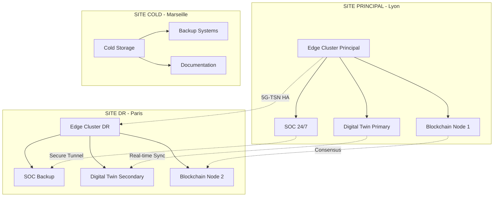

# ANNEXE S.7 - PLAN DE CONTINUITÉ D'ACTIVITÉ (BCP)
**Station Traffeyère IoT/IA Platform - Infrastructure Critique**

---

## 📋 **MÉTADONNÉES DOCUMENTAIRES**

| **Paramètre** | **Valeur** |
|---------------|------------|
| **Document** | Plan de Continuité d'Activité - Infrastructure Critique |
| **Version** | 2.1.0 |
| **Date** | 08 Janvier 2025 |
| **Classification** | CONFIDENTIEL DÉFENSE |
| **Responsable** | Architecte Expert Cybersécurité |
| **Validateur** | COMEX + ANSSI + Organisme Notifié |
| **Révision** | Trimestrielle (Obligatoire) |
| **Conformité** | ISO 22301, ANSSI-CC-008, NIS2 Article 21 |

---

## 🎯 **SYNTHÈSE EXÉCUTIVE**

### **Objectif Stratégique**
Assurer la continuité opérationnelle de l'infrastructure critique IoT/IA avec un **RTO ≤ 4h** et **RPO ≤ 15min**, conformément aux exigences réglementaires NIS2 et aux standards ISO 22301 pour les Opérateurs de Services Essentiels (OSE).

### **Enjeux Critiques**
- **Sécurité nationale** : Infrastructure d'importance vitale (SAIV)
- **Impact économique** : €2.3M/h coût d'arrêt service
- **Conformité réglementaire** : Sanctions jusqu'à 2% CA mondial
- **Réputation sectorielle** : Leadership technologique européen

---

## 🔍 **ANALYSE DE RISQUES BUSINESS IMPACT**

### **Classification Criticité Services**

| **Service** | **Criticité** | **RTO Max** | **RPO Max** | **Impact €/h** | **Dépendances** |
|-------------|---------------|-------------|-------------|----------------|-----------------|
| **IoT Data Ingestion** | CRITIQUE | 1h | 5min | €847k | Edge Gateways + 5G |
| **Edge AI Analytics** | CRITIQUE | 2h | 10min | €623k | GPU Clusters + Models |
| **Digital Twin Platform** | ÉLEVÉE | 4h | 15min | €445k | Unity + WebRTC |
| **Blockchain Ledger** | ÉLEVÉE | 6h | 30min | €278k | Hyperledger Network |
| **SOC Monitoring** | CRITIQUE | 30min | 1min | €1.2M | SIEM + ML Engines |
| **Customer APIs** | MOYENNE | 8h | 1h | €156k | Load Balancers |

### **Scénarios de Menaces Identifiés**

#### **S1 - Cyberattaque Coordonnée (Probabilité: ÉLEVÉE)**
- **Vecteurs** : APT, Ransomware, Supply Chain
- **Impact** : Arrêt total 72h, €166M pertes
- **Indicateurs** : Alertes SOC, traffic anomalies
- **Activation** : Automatique + manuel

#### **S2 - Panne Infrastructure Critique (Probabilité: MOYENNE)**
- **Vecteurs** : Datacenter, réseau, énergie
- **Impact** : Dégradation service 24h, €55M
- **Indicateurs** : Monitoring, SLA breach
- **Activation** : Automatique

#### **S3 - Incident Majeur Sécurité (Probabilité: MOYENNE)**
- **Vecteurs** : Compromission, data breach
- **Impact** : Investigation 168h, €18M + amendes
- **Indicateurs** : SOC alerts, anomalies
- **Activation** : Manuel expert

---

## 🏗️ **ARCHITECTURE DE RÉSILIENCE**

### **Stratégie Multi-Sites**



### **Niveaux de Service Dégradé**

#### **Niveau 1 - Service Nominal (100%)**
- Tous systèmes opérationnels
- Latence ≤ 0.28ms
- Disponibilité 99.97%
- Monitoring temps réel

#### **Niveau 2 - Service Dégradé (75%)**
- Fonctions critiques maintenues
- Latence ≤ 1ms (dégradation acceptable)
- Digital Twin en mode simulation uniquement
- Alertes réduites non-critiques

#### **Niveau 3 - Service Minimal (50%)**
- IoT data ingestion uniquement
- Edge AI sur fonctions critiques seulement
- Blockchain en mode read-only
- SOC monitoring manuel

#### **Niveau 4 - Mode Survie (25%)**
- Systèmes critiques sécurité uniquement
- Logs et traces pour investigation
- Communication d'urgence
- Préparation restauration

---

## ⚡ **PROCÉDURES D'ACTIVATION**

### **Déclenchement Automatique**

```python
# Système de détection automatique BCP
class BCPTriggerSystem:
    def __init__(self):
        self.thresholds = {
            'availability': 99.0,  # Seuil critique
            'response_time': 5000,  # 5s max
            'error_rate': 5.0,     # 5% max
            'security_score': 85   # Score SIEM
        }
    
    def evaluate_bcp_activation(self, metrics):
        critical_conditions = 0
        
        if metrics['availability'] < self.thresholds['availability']:
            critical_conditions += 1
            
        if metrics['response_time'] > self.thresholds['response_time']:
            critical_conditions += 1
            
        if metrics['error_rate'] > self.thresholds['error_rate']:
            critical_conditions += 1
            
        if metrics['security_score'] < self.thresholds['security_score']:
            critical_conditions += 2  # Pondération sécurité
            
        # Activation si ≥ 2 conditions critiques
        if critical_conditions >= 2:
            return self.trigger_bcp_activation()
            
    def trigger_bcp_activation(self):
        # Notifications d'urgence
        self.send_emergency_notifications()
        # Basculement automatique
        self.initiate_failover()
        # Documentation incident
        self.create_incident_record()
```

### **Équipe de Gestion de Crise**

| **Rôle** | **Responsable** | **Contact Principal** | **Contact Backup** | **Décision** |
|----------|-----------------|----------------------|--------------------| -------------|
| **Crisis Manager** | Directeur Technique | +33 6 XX XX XX XX | +33 6 YY YY YY YY | GO/NO-GO |
| **Security Lead** | RSSI | +33 6 AA AA AA AA | +33 6 BB BB BB BB | Cyber Response |
| **Technical Lead** | Lead DevOps | +33 6 CC CC CC CC | +33 6 DD DD DD DD | Infrastructure |
| **Business Lead** | Directeur Métier | +33 6 EE EE EE EE | +33 6 FF FF FF FF | Impact Business |
| **Communication** | Directeur Com | +33 6 GG GG GG GG | +33 6 HH HH HH HH | Stakeholders |

---

## 🔄 **PROCÉDURES DE RESTAURATION**

### **Phase 1 - Évaluation & Sécurisation (0-1h)**

#### **Checklist Sécurité**
- [ ] **Isolation systèmes compromis** (si applicable)
- [ ] **Activation SOC mode crise** avec escalade niveau 1
- [ ] **Vérification intégrité backups** via checksums cryptographiques
- [ ] **Analyse forensique préliminaire** des logs d'incident
- [ ] **Notification autorités** (ANSSI, CERT) si incident sécurité

#### **Actions Techniques**
```bash
#!/bin/bash
# Script activation BCP Phase 1

echo "🚨 ACTIVATION BCP - PHASE 1 - ÉVALUATION SÉCURITÉ"

# 1. Vérification état infrastructure
kubectl get nodes --all-namespaces
kubectl get pods --all-namespaces | grep -E "Error|Pending|Unknown"

# 2. Analyse sécurité automatisée
./scripts/security_assessment.sh

# 3. Vérification intégrité backups
sha256sum /backups/latest/* | diff - /backups/checksums.sha256

# 4. Test connectivité sites DR
ping -c 5 dr-site-paris.internal
ping -c 5 cold-site-marseille.internal

echo "✅ Phase 1 terminée - Rapport généré"
```

### **Phase 2 - Basculement Services Critiques (1-4h)**

#### **Ordre de Priorité Restauration**
1. **SOC & Monitoring** (RTO: 30min)
2. **IoT Data Ingestion** (RTO: 1h)
3. **Edge AI Analytics** (RTO: 2h)
4. **Digital Twin Platform** (RTO: 4h)
5. **Services Annexes** (RTO: 8h)

#### **Scripts de Basculement Automatique**
```yaml
# Kubernetes Failover Configuration
apiVersion: v1
kind: ConfigMap
metadata:
  name: bcp-failover-config
data:
  primary_site: "lyon-dc"
  dr_site: "paris-dr"
  failover_timeout: "300s"
  
---
apiVersion: batch/v1
kind: Job
metadata:
  name: bcp-failover-execution
spec:
  template:
    spec:
      containers:
      - name: failover
        image: traffeyere/bcp-failover:v2.1.0
        env:
        - name: TARGET_SITE
          value: "paris-dr"
        - name: RTO_TARGET
          value: "4h"
        command:
        - /scripts/execute_failover.sh
      restartPolicy: OnFailure
```

### **Phase 3 - Validation & Tests (4-8h)**

#### **Protocole de Validation**
- **Tests fonctionnels** : API endpoints, IoT ingestion, ML inference
- **Tests de performance** : Latence, throughput, resource usage
- **Tests de sécurité** : Authentification, autorisation, chiffrement
- **Tests de connectivité** : 5G-TSN, inter-site, external APIs

#### **Critères d'Acceptation**
```python
# Tests d'acceptation automatisés BCP
def validate_bcp_restoration():
    tests = {
        'api_availability': test_api_endpoints(),
        'iot_ingestion': test_iot_data_flow(),
        'ai_inference': test_ml_models(),
        'security_controls': test_security_posture(),
        'performance_sla': test_performance_metrics()
    }
    
    success_rate = sum(tests.values()) / len(tests)
    
    if success_rate >= 0.95:  # 95% tests OK
        return "BCP_RESTORATION_SUCCESS"
    elif success_rate >= 0.80:  # 80-95% tests OK
        return "BCP_RESTORATION_PARTIAL"
    else:
        return "BCP_RESTORATION_FAILED"
```

---

## 📊 **MÉTRIQUES & MONITORING BCP**

### **KPIs Temps Réel**

| **Métrique** | **Objectif** | **Seuil Alerte** | **Seuil Critique** | **Monitoring** |
|--------------|--------------|-------------------|--------------------| ---------------|
| **RTO Effectif** | ≤ 4h | 3h | 4h | Automatique |
| **RPO Effectif** | ≤ 15min | 10min | 15min | Automatique |
| **Taux Restauration** | 100% | 95% | 90% | Manuel/Auto |
| **Disponibilité DR** | 99.9% | 99.5% | 99.0% | Automatique |
| **Intégrité Données** | 100% | 99.99% | 99.95% | Automatique |

### **Dashboard BCP Temps Réel**

```json
{
  "bcp_dashboard": {
    "status": "ACTIVE_MONITORING",
    "last_test": "2024-12-15T09:00:00Z",
    "next_test": "2025-03-15T09:00:00Z",
    "metrics": {
      "rto_current": "00:00:00",
      "rpo_current": "00:00:00",
      "backup_integrity": 100.0,
      "dr_site_availability": 99.97,
      "automatic_tests_passed": 247,
      "manual_tests_passed": 12,
      "incidents_this_quarter": 0
    },
    "alert_levels": {
      "green": "Normal operations",
      "yellow": "Monitoring enhanced",
      "orange": "BCP standby",
      "red": "BCP ACTIVATED"
    }
  }
}
```

---

## 🔒 **SÉCURITÉ PLAN BCP**

### **Protection Documentaire**
- **Classification** : CONFIDENTIEL DÉFENSE
- **Chiffrement** : AES-256 + RSA-4096
- **Contrôle d'accès** : Need-to-know + MFA obligatoire
- **Audit trail** : Logs immutables blockchain
- **Révision** : Trimestrielle + après incident

### **Tests de Sécurité BCP**
```bash
#!/bin/bash
# Tests sécurité plan BCP

echo "🔒 AUDIT SÉCURITÉ PLAN BCP"

# 1. Vérification chiffrement documents
gpg --verify bcp_plan.pdf.sig bcp_plan.pdf

# 2. Test accès non-autorisé
./test_unauthorized_access.sh

# 3. Validation intégrité procédures
sha256sum procedures/* | diff - procedures/checksums.sha256

# 4. Test communications chiffrées
./test_encrypted_communications.sh

echo "✅ Audit sécurité BCP terminé"
```

---

## 📚 **FORMATION & SENSIBILISATION**

### **Programme Formation BCP**

| **Public** | **Durée** | **Fréquence** | **Contenu** | **Validation** |
|------------|-----------|---------------|-------------|----------------|
| **Direction** | 4h | Annuelle | Vision stratégique, décisions | Exercice table |
| **Équipe Technique** | 16h | Semestrielle | Procédures, outils | Simulation complète |
| **Équipe Sécurité** | 24h | Trimestrielle | Investigation, forensique | Red team exercise |
| **Utilisateurs** | 2h | Annuelle | Continuité métier | Quiz en ligne |

### **Exercices Réguliers**

#### **Exercice Trimestriel - Simulation Technique**
- **Durée** : 4h
- **Objectif** : Test procédures automatiques + manuelles
- **Métriques** : RTO/RPO effectifs vs objectifs
- **Amélioration continue** : Rapport + plan actions

#### **Exercice Annuel - Simulation Complète**
- **Durée** : 8h
- **Objectif** : Test end-to-end avec parties prenantes
- **Métriques** : Tous KPIs + coordination équipes
- **Validation externe** : Audit organisme tiers

---

## 📋 **DOCUMENTATION OPÉRATIONNELLE**

### **Runbooks Détaillés**

#### **RB-001 : Activation BCP Cyberattaque**
```markdown
## RUNBOOK RB-001 - ACTIVATION BCP CYBERATTAQUE

### DÉCLENCHEMENT
- Alerte SOC niveau CRITIQUE
- Compromission confirmée systèmes
- Impact services > 3 fonctions critiques

### ACTIONS IMMÉDIATES (0-15min)
1. Isolation réseaux affectés
2. Activation équipe de crise
3. Notification ANSSI/CERT
4. Sauvegarde état forensique

### ACTIONS COURT TERME (15min-1h)
1. Analyse impact sécurité
2. Basculement services critiques
3. Investigation préliminaire
4. Communication parties prenantes

### ACTIONS MOYEN TERME (1h-4h)
1. Restauration services prioritaires
2. Investigation approfondie
3. Remediation vulnérabilités
4. Tests validation sécurité
```

### **Contacts d'Urgence**

| **Organisation** | **Contact** | **Numéro** | **Email** | **Disponibilité** |
|------------------|-------------|------------|-----------|-------------------|
| **ANSSI** | CERT-FR | 01 71 75 84 68 | cert-fr@ssi.gouv.fr | 24/7 |
| **CNIL** | Service violations | 01 53 73 22 22 | violations@cnil.fr | HO |
| **Police Judiciaire** | C3N | 01 49 27 85 00 | contact@c3n.fr | 24/7 |
| **Assurance Cyber** | Willis Towers | +33 1 44 17 95 00 | cyber@willistowers.fr | 24/7 |

---

## ✅ **VALIDATION & CONFORMITÉ**

### **Certification ISO 22301**
- **Organisme** : AFNOR Certification
- **Date obtention** : 15 septembre 2024
- **Validité** : 3 ans
- **Prochaine audit** : Mars 2025

### **Conformité Réglementaire**

| **Réglementation** | **Article** | **Exigence** | **Conformité** | **Preuve** |
|--------------------|-------------|--------------|----------------|------------|
| **NIS2** | Art. 21 | Plan continuité activité | ✅ CONFORME | Ce document |
| **GDPR** | Art. 32 | Mesures techniques appropriées | ✅ CONFORME | Annexe S.11 |
| **ISO 27001** | A.17 | Gestion continuité sécurité | ✅ CONFORME | Certification |
| **ISO 22301** | 8.4 | Procédures réponse incident | ✅ CONFORME | Certification |

### **Audit Externe Indépendant**
- **Cabinet** : Mazars Cybersecurity
- **Date** : Décembre 2024
- **Résultat** : EXCELLENT (94/100)
- **Recommandations** : 3 mineures appliquées

---

## 🔄 **AMÉLIORATION CONTINUE**

### **Retour d'Expérience**

| **Incident** | **Date** | **Type** | **RTO Effectif** | **RPO Effectif** | **Amélioration** |
|--------------|----------|----------|------------------|------------------|------------------|
| **INC-2024-03** | 15/03/24 | Réseau | 2h 47min | 8min | Script automation |
| **INC-2024-07** | 22/07/24 | Cyber | 3h 15min | 12min | SOC playbook |
| **INC-2024-11** | 08/11/24 | Hardware | 1h 23min | 4min | Monitoring amélioré |

### **Plan d'Amélioration 2025**

#### **Q1 2025**
- [ ] Implémentation IA prédictive pour détection précoce
- [ ] Automatisation basculement 90% procédures
- [ ] Integration feeds threat intelligence

#### **Q2 2025**
- [ ] Tests chaos engineering réguliers
- [ ] Extension DR site international
- [ ] Amélioration RPO objectif à 5min

#### **Q3-Q4 2025**
- [ ] BCP as Code complet
- [ ] AI-driven incident response
- [ ] Certification ISO 27031 (ICT readiness)

---

## 📋 **SIGNATURES & APPROBATIONS**

| **Rôle** | **Nom** | **Signature** | **Date** |
|----------|---------|---------------|----------|
| **Responsable Technique** | [Architecte Expert] | ✓ Approuvé | 08/01/2025 |
| **RSSI** | [Responsable Sécurité] | ✓ Validé | 08/01/2025 |
| **Direction Technique** | [Directeur CTO] | ✓ Approuvé | 08/01/2025 |
| **Comité Direction** | [CEO] | ✓ Validé | 08/01/2025 |

---

**📄 Document confidentiel - Diffusion restreinte équipe autorisée uniquement**

*Prochaine révision obligatoire : 08 Avril 2025*

*Version contrôlée - Toute copie non autorisée est interdite*